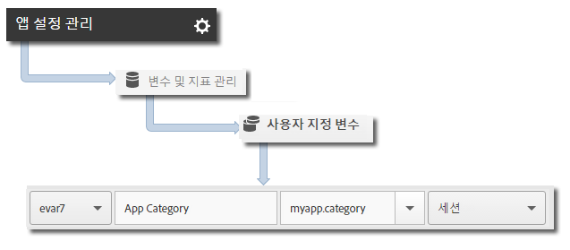

# Core implementation and lifecycle {#core-implementation-and-lifecycle}

다음은 Android 라이브러리를 구현하고 시작, 업그레이드, 세션, 참여 사용자 등의 라이프사이클 지표를 수집하는 데 유용한 정보입니다.

## SDK 다운로드 {#section_99FE1A17A36D4A2C943939023CF6265C}

>[!IMPORTANT]
>
>SDK를 다운로드하려면 Android 2.2 이상을 사용해야 합니다.

1. 다음 섹션의 단계를 완료하여 개발 보고서 세트를 설정하고 미리 채워진 구성 파일 버전을 다운로드합니다.

   * [보고서 세트 생성](/help/android/getting-started/requirements.md)
   * [SDK 다운로드](/help/android/getting-started/requirements.md)

1. `[Your_App_Name_]AdobeMobileLibrary-4.*-Android.zip` 파일을 다운로드 및 압축 해제하고 다음 소프트웨어 구성 요소가 있는지 확인합니다.

   * `adobeMobileLibrary.jar`Android 장치 및 시뮬레이터와 함께 사용할 라이브러리입니다.

   * `ADBMobileConfig.json`: 앱에 맞게 사용자 지정된 SDK 구성 파일입니다.
   >[!IMPORTANT]
   >
   >If you download the SDK outside the Adobe Mobile services UI, the `ADBMobileConfig.json` file must be manually configured. If you are new to Analytics and the Mobile SDK, and you want to set up a development report suite and download a pre-populated version of the configuration file, see [Before You Start](/help/android/getting-started/requirements.md).

## Add the SDK and config file to your IntelliJ IDEA or Eclipse project {#section_B89510FBB4C646AEA73A185B966E54D3}

**Intellij IDEA Project**

프로젝트에 SDK 및 구성 파일을 추가하려면

1. Add the `ADBMobileConfig.json` file to the `assets` folder in your project.

1. 프로젝트 탐색 패널에서 프로젝트를 마우스 오른쪽 단추로 클릭합니다.
1. **[!UICONTROL 모듈 설정 열기를 선택합니다]**.
1. **[!UICONTROL 프로젝트 설정에서]****[!UICONTROL 라이브러리를]**&#x200B;선택합니다.
1. **[!UICONTROL +]** 아이콘을 클릭하여 새 라이브러리를 추가합니다.
1. **[!UICONTROL Java]**&#x200B;를 선택하고 `adobeMobileLibrary.jar` 파일로 이동합니다.
1. 모바일 라이브러리를 사용할 모듈을 선택합니다.
1. **[!UICONTROL 적용]**&#x200B;을 클릭한 다음 **[!UICONTROL 확인]을 클릭하여 모듈 설정 창을 닫습니다.**

**Eclipse 프로젝트**

프로젝트에 SDK 및 구성 파일을 추가하려면

1. Add the `ADBMobileConfig.json` file to the `assets` folder in your project.
1. **[!UICONTROL Eclipse IDE]**&#x200B;에서 프로젝트 이름을 마우스 오른쪽 버튼으로 클릭합니다.
1. **[!UICONTROL 작성 경로]** &gt; 외부 아카이브 **[!UICONTROL 추가를]**&#x200B;클릭합니다.
1. 선택 `adobeMobileLibrary.jar`.
1. **[!UICONTROL 열기를 클릭합니다]**.
1. Right-click the project again and select **[!UICONTROL Build Path]** &gt; **[!UICONTROL Configure Build Path]**.
1. **[!UICONTROL 주문 및 내보내기]** 탭에서 **`adobeMobileLibrary.jar`이 선택되었는지 확인합니다.**

## Add app permissions {#section_2EAF73ABF6424647B219A63B33B02CD5}

AppMeasurement 라이브러리를 사용하려면 데이터를 전송하고 오프라인 추적 호출을 기록할 다음 권한이 필요합니다.

* `INTERNET`
* `ACCESS_NETWORK_STATE`

이러한 권한을 추가하려면 애플리케이션 프로젝트 디렉터리의 `AndroidManifest.xml` 파일에 다음 줄을 추가합니다.

```java
<uses-permission android:name="android.permission.INTERNET" /> 
<uses-permission android:name="android.permission.ACCESS_NETWORK_STATE" />
```

## Set the application context {#set-application-context}

다음 코드는 주 활동의 `onCreate` 메서드에 추가해야 합니다.

```java
   @Override
   public void onCreate(BundlesavedInstanceState){
     super.onCreate(savedInstanceState)
     setContentView(R.layout.main);
     Config.setContext(this.getApplicationContext());
   }
````

## Implement lifecycle metrics {#section_BA686C09021F474AADDE8690BBB910F7}

라이프사이클을 사용하면 앱이 시작될 때마다 시작, 업그레이드, 세션, 참여 사용자 및 기타 여러 지표를 측정하기 위해 한 번의 히트가 전송됩니다. 자세한 내용은 [라이프사이클 지표](/help/android/metrics.md)를 참조하십시오.

**애플리케이션의 각 활동에서 다음 단계를 완료하십시오.**

1. 라이브러리를 가져옵니다:

   ```java
   import com.adobe.mobile.*;
   ```

1. `onResume` 함수에서 라이프사이클 데이터 수집을 시작합니다.

   ```java
   @Override 
   public void onResume() { 
       Config.collectLifecycleData(this); 
       // -or- Config.collectLifecycleData(this, contextData); 
   }
   ```

1. `onPause` 함수에서 라이프사이클 데이터 수집을 일시 중지합니다.

   ```java
   @Override 
   public void onPause() { 
       Config.pauseCollectingLifecycleData(); 
   }
   ```

>[!IMPORTANT]
>
>정확한 충돌 보고를 위해 모든 활동에 이러한 호출을 추가해야 합니다. 자세한 내용은 앱 충돌 [추적을](/help/android/analytics-main/crashes.md)참조하십시오.

## 라이프사이클 호출을 사용하여 추가 데이터 포함

라이프사이클 지표 호출을 통해 추가 데이터를 포함하려면 컨텍스트 데이터가 포함된 `collectLifecycleData`에 추가 매개 변수를 전달하십시오.

```java
@Override 
public void onResume() {
    HashMap<String, Object> contextData = new HashMap<String, Object>(); 
    contextData.put("myapp.category", "Game"); 
    Config.collectLifecycleData(this, contextData); 
}
```

`collectLifecycleData`와 함께 전송되는 추가 컨텍스트 데이터 값은 Adobe Mobile Services의 사용자 지정 변수에 매핑해야 합니다.



다른 라이프사이클 지표는 자동으로 수집됩니다. 자세한 내용은 [라이프사이클 지표](/help/android/metrics.md)를 참조하십시오.

## 다음 단계 {#section_BF709684E1DD40EA9169BC1D0D4B37C2}

다음 작업을 완료하십시오.

* [앱 상태 추적](/help/android/analytics-main/states.md)
* [앱 작업 추적](/help/android/analytics-main/actions.md)

