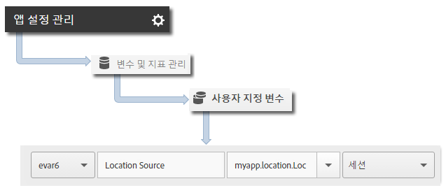

# 지리적 위치 및 관심 영역 {#geo-location-and-points-of-interest}

지리적 위치는 Android 앱에서 위도와 경도 및 사전 정의된 관심 영역을 사용하여 위치 데이터를 측정할 수 있도록 합니다.

각 `trackLocation` 호출에서는 다음 정보를 보냅니다.

* Adobe Mobile Services UI에 정의된 관심 영역(POI)의 위도, 경도 및 위치.

   이 정보는 자동 보고를 위해 모바일 솔루션 변수로 전달됩니다.

* 중앙으로부터의 거리 및 컨텍스트 데이터로 전달된 정확도.

   이러한 변수는 자동으로 캡처되지 않습니다. 아래 *추가 데이터 보내기* 섹션의 지침에 따라 이러한 컨텍스트 데이터 변수를 매핑해야 합니다.

## 동적 POI 업데이트 {#section_3747B310DD5147E2AAE915E762997712}

버전 4.2부터 POI는 Adobe Mobile UI에서 정의되며 앱 구성 파일과 동적으로 동기화됩니다. 이 동기화를 수행하려면 `analytics.poi`ADBMobile JSON 구성[의 ](/help/android/configuration/json-config/json-config.md) 설정이 필요합니다.

```js
"analytics.poi": "https://assets.adobedtm.com/…/yourfile.json",
```

구성되지 않은 경우 `ADBMobile.json` 파일의 업데이트된 버전을 다운로드하여 앱에 추가해야 합니다. 자세한 내용은 [SDK 및 테스트 도구 다운로드](/help/android/getting-started/requirements.md)를 참조하십시오.

## 지리적 위치 및 POI 추적 {#section_B1616E400A7548F9A672F97FEC75AE27}

1. 프로젝트에 라이브러리를 추가하고 라이프사이클을 구현합니다.

   자세한 내용은 [핵심 구현 및 라이프사이클](/help/android/getting-started/dev-qs.md)에서 *IntelliJ IDEA 또는 Eclipse 프로젝트에 SDK 및 구성 파일 추가*&#x200B;를 참조하십시오.

1. 라이브러리를 가져옵니다:

   ```java
   import com.adobe.mobile.*;
   ```

1. `trackLocation`을 호출하여 현재 위치를 추적합니다.

   ```java
   Location currentLocation = new Location("my location here"); 
   Analytics.trackLocation(currentLocation, null);
   ```

   >[!TIP]
   >
   >언제든지 `trackLocation`을 호출할 수 있습니다.

   위치 전략을 사용하여 `trackLocation` 호출에 전달되는 위치를 확인할 수 있습니다. 자세한 내용은 [Android 위치 전략](https://developer.android.com/guide/topics/location/strategies.html)을 참조하십시오.

또한 정의된 POI 반경 내에 위치가 있는 것으로 확인되면 `a.loc.poi` 컨텍스트 데이터 변수가 `trackLocation` 히트와 함께 전송되며 ****&#x200B;위치 분석 보고서에서 POI로 보고됩니다. `a.loc.dist` 컨텍스트 변수도 정의된 좌표로부터 떨어진 거리(단위: 미터)와 함께 전송됩니다.

## 추가 데이터 보내기 {#section_3EBE813E54A24F6FB669B2478B5661F9}

위치 데이터 외에, 각 위치 추적 호출로 추가 컨텍스트 데이터를 전송할 수 있습니다.

```java
HashMap<String, Object> locationContextData = new HashMap<String, Object>(); 
locationContextData.put("myapp.location.LocationSource", "GPS"); 
 
Location currentLocation = new Location("my location here"); 
Analytics.trackLocation(currentLocation, locationContextData);
```

컨텍스트 데이터 값은 Adobe Mobile Services UI의 사용자 지정 변수에 매핑되어야 합니다.



## 위치 컨텍스트 데이터 {#section_FFB71E6653F9410A89CC6ACC0C9164A9}

위도와 경도는 세 개의 서로 다른 컨텍스트 데이터 매개 변수를 사용하여 전송되며 각 매개변수는 총 6개의 컨텍스트 데이터 매개 변수에 대해 다른 수준의 정밀도를 나타냅니다.

예를 들어, 위도 = 40.93231, 경도 = -111.93152는 정밀도가 1m인 위치를 나타냅니다. 이 위치는 다음 변수에서 정밀도 수준에 따라 분할됩니다.

`a.loc.lat.a`= 040.9

`a.loc.lat.b` = 32

`a.loc.lat.c` = 31

`a.loc.lon.a` = -111.9

`a.loc.lon.b` = 31

`a.loc.lon.c` = 52

일부 정밀도 수준은 현재 위치의 정확도에 따라 `00`으로 나타날 수도 있습니다. 예를 들어 위치가 현재 100m까지 정확하면 `a.loc.lat.c` 및 `a.loc.lon.c`에 `00` 값이 채워집니다.

다음 정보를 숙지하십시오.

* `trackLocation` 요청은 `trackAction` 호출과 같은 방식으로 전송됩니다.

* POI는 일반적인 `trackAction` 및 `trackState` 호출의 일부로 전달되지 않으므로, POI를 추적하려면 `trackLocation` 호출을 사용해야 합니다.

* `trackLocation`은 위치 및 POI를 추적하는 데 필요한 만큼 자주 호출해야 합니다.

   앱이 시작될 때 `trackLocation`을 호출한 다음 필요할 경우 앱의 요구 사항에 따라 호출하는 것이 좋습니다.

* POI는 앱 구성 파일에서 정의된 후에만 그 값이 채워집니다.

   POI는 이전에 전송된 과거 `trackLocation` 호출에는 적용되지 않습니다.
* `trackLocation` 호출은 `trackAction` 호출과 유사하게, 추가 컨텍스트 데이터 전송을 지원합니다.

* 두 POI의 지름이 겹치는 경우 현재의 위치가 포함된 첫 번째 POI가 사용됩니다.

   POI가 겹치는 경우, 가장 세부적인 POI가 보고되도록 가장 세부적인 것에서 가장 세부적이지 않은 것의 순서로 정렬된 POI를 나열해야 합니다.
