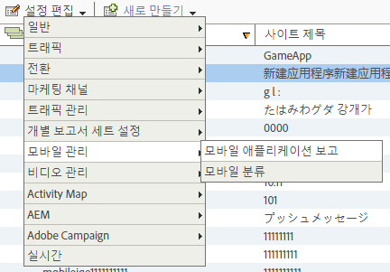

# Analytics {#analytics}

라이브러리를 프로젝트에 추가한 후에는 앱의 어느 곳에서든 Analytics 메서드를 호출할 수 있습니다(ADBMobile.h를 클래스에 가져오는지 확인).

## Analytics에서 모바일 애플리케이션 보고서 활성화 {#task_3DA1354942CF4BF4B11B9CC97588A9ED}

코드를 추가하기 전에 Analytics 관리자가 다음을 완료하여 모바일 앱 라이프사이클 추적을 활성화하도록 하십시오. 이러한 작업을 수행하면 개발을 시작할 때 보고서 세트가 지표를 캡처할 준비가 된 것입니다.

1. **[!UICONTROL 관리 도구]** > **[!UICONTROL 보고서 세트]**&#x200B;를 열고 모바일 보고서 세트를 선택합니다.
1. **[!UICONTROL 설정 편집]** > **[!UICONTROL 모바일 관리]** > **[!UICONTROL 모바일 애플리케이션 보고]**&#x200B;를 클릭합니다.

   

1. **[!UICONTROL 최신 앱 보고서 활성화]**&#x200B;를 클릭합니다.

   원할 경우 **[!UICONTROL 모바일 위치 추적 활성화]** 및 **[!UICONTROL 배경 히트에 대한 이전 보고 및 속성 활성화]**&#x200B;를 클릭할 수도 있습니다.

   

이제 라이프사이클 지표를 캡처할 준비가 되었으며, 모바일 애플리케이션 보고서가 마케팅 보고서 인터페이스의 **[!UICONTROL 보고서]** 메뉴에 표시됩니다.

## 라이프사이클 지표 수집 {#task_25D469C62DF84573AEB5E8E950B96205}

1. 앱에서 라이프사이클 지표를 수집하려면 `ApplicationUI` 생성자에서 `collectLifecycleData()`을 호출하십시오.

   예:

   ```java
   ApplicationUI::ApplicationUI(bb::cascades::Application *app): QObject(app) { 
   //... 
   ADBMobile::collectLifecycleData(); 
   } 
   ```

   동일한 세션에서 `collectLifecycleData()`이 두 번 호출되면 애플리케이션이 첫 번째 호출 후 모든 호출 시 충돌을 보고합니다. SDK는 애플리케이션이 종료될 때 성공적인 종료를 나타내는 플래그를 설정합니다. 이 플래그가 설정되지 않은 경우 `collectLifecyleData()` 은 충돌을 보고합니다.

## Event, Prop 및 eVar {#concept_B885D5A71A5D45129CE7C1C3426A7D28}

[ADBMobile 클래스 및 메서드 참조](/help/blackberry/methods.md)를 본 경우 이벤트, eVars, prop, 상속자 및 목록을 어디에 설정해야 하는지 알고 싶을 수 있습니다. 버전 4에서는 더 이상 그러한 유형의 변수를 앱에서 바로 할당할 수 없습니다. 대신, SDK는 컨텍스트 데이터 및 처리 규칙을 사용하여 앱 데이터를 Analytics 변수에 매핑해서 보고에 사용합니다.

처리 규칙은 다음과 같은 몇 가지 이점을 제공합니다.

* 앱스토어에 업데이트를 제출하지 않고 데이터 매핑을 변경할 수 있습니다.
* 보고서 세트에 고유한 변수를 설정하는 대신 데이터에 의미 있는 이름을 사용할 수 있습니다.
* 추가 데이터 전송에는 거의 영향을 주지 않습니다. 이러한 값은 처리 규칙을 사용하여 매핑될 때까지 보고서에 표시되지 않습니다.

변수에 직접 할당한 값은 모두 `data` HashMap에 대신 추가해야 합니다.

## 처리 규칙 {#concept_3EA4CD602AF4488A896B0EDD3BA2D969}

처리 규칙은 컨텍스트 데이터 변수로 보내는 데이터를 보고를 위해 eVar, prop 및 기타 변수에 복사하는 데 사용됩니다.

[처리 규칙](https://experienceleague.adobe.com/docs/analytics/admin/admin-tools/processing-rules/processing-rules.html)

Adobe은 &quot;네임스페이스&quot;를 사용하여 컨텍스트 데이터 변수를 그룹화할 것을 권장합니다. 이렇게 하면 논리적 순서를 유지할 수 있습니다. 예를 들어 제품에 대한 정보를 수집하려는 경우 다음 변수를 정의할 수 있습니다.

```js
"product.type":"hat";
"product.team":"mariners";
"product.color":"blue";
```

컨텍스트 데이터 변수는 처리 규칙 인터페이스에서 알파벳순으로 정렬되므로 네임스페이스를 통해 동일한 네임스페이스에 있는 변수를 빠르게 볼 수 있습니다.

또한 일부 사용자가 eVar 또는 prop 번호를 사용하여 컨텍스트 데이터 키의 이름을 지정한다고 들었습니다.

```js
"eVar1":"jimbo";
```

이 경우 처리 규칙에서 1회 매핑을 수행할 때는 *약간* 더 쉬워질 수 있지만 디버깅이나 향후 코드 업데이트 중에 가독성을 잃게 될 수 있습니다. 대신 키와 값에 수사적 이름을 사용하는 것이 좋습니다.

```js
"username":"jimbo";
```

카운터 이벤트를 정의하는 컨텍스트 변수는 동일한 키와 값을 가질 수 있습니다.

```js
"logon":"logon";
```

상향 조정기 이벤트를 정의하는 컨텍스트 데이터 변수는 이벤트를 키로 사용하고 크기가 이 값으로 증가할 수 있습니다.

```js
"levels completed":"6";
```

>[!TIP]
>
>Adobe는 `a.` 네임스페이스를 예약합니다. 이러한 작은 제한 사항 외에 컨텍스트 데이터 변수는 충돌을 방지하기 위해 로그인 회사에서 고유해야 합니다.

## 오프라인 추적 활성화 {#concept_402F4ECE240B4CA1B779322A7BFCB8DE}

장치가 오프라인 상태일 때 히트를 저장하려면 `ADBMobileConfig.json` 파일에서 오프라인 추적을 선택적으로 활성화할 수 있습니다.

오프라인 추적을 활성화하기 전에 구성 파일 참조에 설명된 타임스탬프 요구 사항에 주의하십시오.

## Analytics 메서드

BlackBerry에 사용할 수 있는 Analytics 메서드 목록은 *Adobe 모바일 클래스 및 메서드 참조](/help/blackberry/methods.md)에서 [Analytics 메서드*&#x200B;를 참조하십시오.
