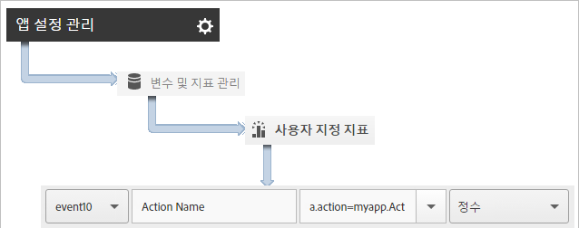
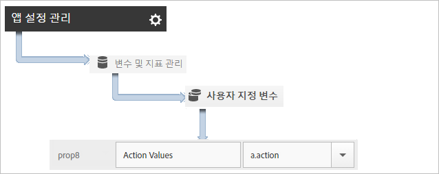

# 앱 작업 추적 {#track-app-actions}

작업은 측정할 앱에서 발생하는 이벤트입니다. 각 작업에는 이벤트가 발생할 때마다 늘어나는 하나 이상의 해당 지표가 있습니다. 예를 들어 문서를 볼 때마다 또는 수준이 완료될 때마다 새 가입을 추적할 수 있습니다. 이러한 이벤트에 대한 해당 지표는 가입, 읽은 문서 및 완료 수준으로 구성됩니다.

작업이 자동으로 추적되지 않으므로 이벤트를 추적하기 위해서는 `trackAction`을 호출해야 합니다.

## 작업 추적 {#section_380DF56C4EE4432A823940E4AE4C9E91}

1. 프로젝트에 라이브러리를 추가하고 라이프사이클을 구현합니다.

   자세한 내용은 [핵심 구현 및 라이프사이클](/help/ios/getting-started/dev-qs.md)에서 *프로젝트에 SDK 및 구성 파일 추가*&#x200B;를 참조하십시오.
1. 라이브러리를 가져옵니다.

   ```objective-c
   #import "ADBMobile.h"
   ```

1. 추적하려는 작업이 앱에서 발생하면 `trackAction`을 호출하여 이 작업에 대한 히트를 보냅니다.

   ```objective-c
   [ADBMobile trackAction:@"myapp.ActionName"  
                     data:nil];
   ```

   >[!TIP]
   >
   >앱이 백그라운드에 있을 때 이 호출을 추가할 코드가 실행될 경우 `trackAction` 대신 `trackActionFromBackground`를 호출하십시오.

1. Adobe Mobile Services UI에서 앱을 선택하고 **[!UICONTROL 앱 설정 관리]**&#x200B;를 클릭합니다.

1. **[!UICONTROL 변수 및 지표 관리]**&#x200B;를 클릭하고 **사용자 지정 지표[!UICONTROL 탭을 클릭합니다.]**

1. 코드에 정의된 컨텍스트 데이터 이름(예: `a.action=myapp.ActionName`)을 사용자 지정 이벤트에 매핑합니다.

   

**[!UICONTROL 사용자 지정 작업]**&#x200B;과 같은 이름으로 사용자 지정 prop을 매핑하고 값을 `a.action`으로 설정하여 모든 작업 값을 유지할 prop을 설정할 수도 있습니다.



## 추가 데이터 보내기 {#section_3EBE813E54A24F6FB669B2478B5661F9}

작업 이름 외에도 각 작업 추적 호출로 추가 컨텍스트 데이터를 전송할 수 있습니다.

```objective-c
NSMutableDictionary *contextData = [NSMutableDictionary dictionary]; 
[contextData setObject:@"Twitter" forKey:@"myapp.social.SocialSource"]; 
[ADBMobile trackAction:@"myapp.SocialShare" data:contextData];
```

컨텍스트 데이터 사용자 지정 변수에 매핑해야 합니다.


## 백그라운드 작업 추적 {#section_AC13013F207D4FBAAF27E4412034251E}

앱이 백그라운드에 있을 때 실행할 수 있는 코드에서 작업을 추적하는 경우, `trackActionFromBackground` 대신 `trackAction`를 호출하십시오. `trackActionFromBackground`에 라이프사이클 호출이 실행되지 말아야 할 경우 실행을 방지하는 몇 가지 추가 로직이 포함되어 있지만 매개 변수는 동일합니다.

## 작업 보고 {#section_0F6A54AB7A3F42C9BB042D86A0FC4630}

| 인터페이스 | 보고서 |
|--- |--- |
| Adobe Mobile Services | ****&#x200B;작업 경로 보고서. 앱에서 작업이 발생하는 순서를 봅니다. 보고서에서 **[!UICONTROL 사용자 지정]을 클릭하여 등급이 매겨지거나, 트렌드가 분석되거나, 분류 보고서에 있는 작업을 보거나, 필터 적용을 통해 특정 세그먼트에 대한 작업을 볼 수도 있습니다.** |
| Marketing Reports and Analytics | **[!UICONTROL 사용자 지정 이벤트]**&#x200B;를 보고합니다.  작업이 사용자 지정 이벤트에 매핑되면 다른 모든 Analytics 이벤트와 유사한 모바일 이벤트를 볼 수 있습니다. |
| Ad hoc analytics | **[!UICONTROL 사용자 지정 이벤트]**&#x200B;를 보고합니다. 작업이 사용자 지정 이벤트에 매핑되면 다른 모든 Analytics 이벤트와 유사한 모바일 이벤트를 볼 수 있습니다. |