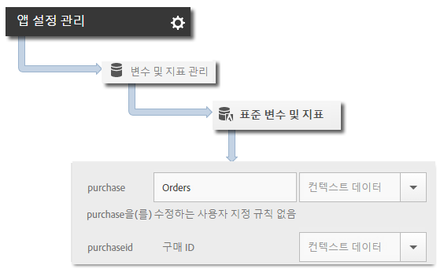

# Products 변수 {#products-variable}

처리 규칙을 사용하여 제품 변수를 설정할 수 없습니다. iOS 4.x SDK에서는 컨텍스트 데이터 매개 변수의 특수 구문을 사용하여 서버 호출에 직접 제품을 설정해야 합니다.

*`products`*&#x200B;변수를 설정하려면 컨텍스트 데이터 키를 `"&&products"`로 설정하고 *`products`* 변수에 대해 정의된 구문을 사용하여 값을 설정하십시오.

```objective-c
[contextData setObject:@"Category;Product;Quantity;Price[,Category;Product;Quantity;Price]" forKey:@"&&products"];
```

예:

```objective-c
//create a context data dictionary 
NSMutableDictionary *contextData = [NSMutableDictionary dictionary]; 
 
// add products, a purchase id, a purchase context data key, and any other data you want to collect. 
// Note the special syntax for products 
[contextData setObject:@";Running Shoes;1;69.95,;Running Socks;10;29.99" forKey:@"&&products"]; 
[contextData setObject:@"1234567890" forKey:@"m.purchaseid"]; 
[contextData setObject:@"1" forKey:@"m.purchase"]; 
 
// send the tracking call - use either a trackAction or TrackState call. 
// trackAction example: 
[ADBMobile trackAction:@"purchase" data:contextData]; 
// trackState example: 
[ADBMobile trackState:@"Order Confirmation" data:contextData]; 
```

*`products`*&#x200B;는 이미지 요청에 직접 설정되고 다른 변수는 컨텍스트 데이터로 설정됩니다. 모든 컨텍스트 데이터 변수는 처리 규칙을 사용하여 매핑해야 합니다.



이 변수는 SDK에서 직접 이미지 요청에 설정했기 때문에 *`products`* 변수를 처리 규칙에 따라 매핑할 필요는 없습니다.
