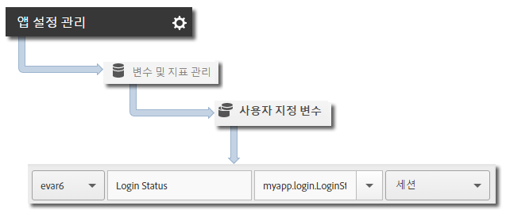

# 앱 상태 추적 {#track-app-states}

상태는 애플리케이션의 다양한 화면 또는 보기입니다. 새로운 상태가 애플리케이션에 표시될 때마다(예: 사용자가 홈페이지에서 뉴스피드로 이동할 때) 상태 추적 호출을 보내야 합니다. iOS에서 상태는 일반적으로 각 보기의 viewDidLoad 메서드에서 추적됩니다.

>[!TIP]
>
>To track states, make a call to `trackState`. 상태는 자동으로 추적되지 않습니다.

## Tracking states {#section_380DF56C4EE4432A823940E4AE4C9E91}

1. 프로젝트에 라이브러리를 추가하고 라이프사이클을 구현합니다.

   For more information, see Add the SDK and Config File to your Project in Core Implementation and Lifecycle.**[](/help/ios/getting-started/dev-qs.md)
1. 라이브러리를 가져옵니다.

   ```objective-c
   #import "ADBMobile.h"
   ```

1. `trackState`를 호출하여 이 상태 보기에 대한 히트를 보냅니다.

   ```objective-c
   [ADBMobile trackState:@"Login Screen"  
                    data:nil];
   ```

In Adobe Mobile services, the **[!UICONTROL State Name]** is reported in the *`View State`* variable, and a view is recorded for each `trackState` call. 다른 분석 인터페이스에서 **[!UICONTROL 상태 보기]**&#x200B;는 **[!UICONTROL 페이지 이름]**&#x200B;으로 보고되며, 상태 보기는 페이지 보기 횟수로 보고됩니다.

## Sending additional data {#section_CFDB4F944496401786A145C209AB387C}

In addition to the **[!UICONTROL State Name]**, you can send additional context data with each track action call:

```objective-c
NSMutableDictionary *contextData = [NSMutableDictionary dictionary]; 
[contextData setObject:@"logged in" forKey:@"myapp.login.LoginStatus"]; 
[ADBMobile trackState:@"Home Screen" data:contextData];
```

컨텍스트 데이터 값은 사용자 지정 변수에 매핑되어야 합니다.



## App state reporting {#section_0F6A54AB7A3F42C9BB042D86A0FC4630}

상태는 일반적으로 경로 지정 보고서를 사용하여 표시되므로 사용자가 앱을 이동하는 방법과 가장 많이 본 상태를 볼 수 있습니다.

|  |  |
|--- |--- |
| Adobe Mobile Services | **[!UICONTROL 상태 보기]보고서.** 이 보고서는 사용자가 애플리케이션을 통해 가져온 경로를 기반으로 합니다. A sample path is  **[!UICONTROL Home]**  &gt;  **[!UICONTROL Settings]**  &gt; **[!UICONTROL Feed]**. |
| Adobe Analytics | 상태는 **페이지** 보고서, **[!UICONTROL 페이지 보기]** 보고서 및 **경로[!UICONTROL 보고서와 같이 페이지를 볼 수 있는 모든 위치에서 볼 수 있습니다 .]** |
| Ad hoc analytics | 상태는 **페이지** 차원, **[!UICONTROL 페이지 보기 횟수]** 지표 및 **경로[!UICONTROL 보고서를 사용하여 페이지를 볼 수 있는 모든 위치에서 볼 수 있습니다.]** |
