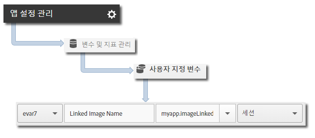

# iBeacon 추적 {#ibeacon-tracking}

iBeacon 추적을 사용하면 iBeacon 및 저전력 블루투스를 사용하여 미세 위치를 측정하고 타깃팅할 수 있습니다.

`trackBeacon`이 호출되면 다음 비콘 데이터가 Analytics 및 Target으로 전송됩니다.

* `a.beacon.uuid` - 비콘의 Proximityuuid
* `a.beacon.major` - 주 비콘 번호(예: 스토어 번호)
* `a.beacon.minor` - 부 비콘 번호(예: 스토어 내 고유 번호)
* `a.beacon.prox` - 다음 값은 사용자와 비콘이 얼마나 가까운지 나타냅니다.

   * `0`: 알 수 없음
   * `1`: 바로 가까이에 있음
   * `2`: 근처에 있음
   * `3`: 멀리 있음

## Ibeacons 추적 {#section_FC3F213545944A468B1E6D5D5C8E2F1F}

1. 프로젝트에 라이브러리를 추가하고 라이프사이클을 구현합니다.

   자세한 내용은 핵심 구현 *및* 라이프사이클에서 [프로젝트에 SDK 및 구성 파일 추가를](/help/ios/getting-started/dev-qs.md)참조하십시오.
1. 라이브러리를 가져옵니다:

   ```objective-c
   #import "ADBMobile.h"
   ```

1. 장치가 비콘의 근접 거리 내에 있으면 `trackBeacon`을 호출합니다.

   ```objective-c
   [ADBMobile trackBeacon:beacon data:nil];
   ```

1. 사용자가 비콘의 근접 거리를 벗어나면 현재 비콘을 지웁니다.

   ```objective-c
   [ADBMobile trackingClearCurrentBeacon];
   ```

## Send additional data {#section_3EBE813E54A24F6FB669B2478B5661F9}

시간이 지정된 작업 이름 외에, 각 작업 추적 호출로 추가 컨텍스트 데이터를 전송할 수 있습니다.

```objective-c
[ADBMobile trackBeacon:beacon data:@{@"myapp.ImageLiked" : imageName}];
```

컨텍스트 데이터 값은 사용자 지정 변수에 매핑되어야 합니다.



## 예 {#section_9749238BCBC148998CB18E97D7670D19}

```objective-c
- (void)locationManager:(CLLocationManager *)manager didRangeBeacons:(NSArray *)beacons inRegion:(CLBeaconRegion *)region { 
    if (beacons.count > 0) { 
        CLBeacon *beacon = beacons[0]; 
        // Adobe - track when in range of a beacon 
        [ADBMobile trackBeacon:beacon data:@{@"sampleContextData" : @"sampleContextDataVal"}]; 
    } 
} 
 
// When the user leaves the proximity of the beacon, clear the current beacon 
[ADBMobile trackingClearCurrentBeacon];
```

