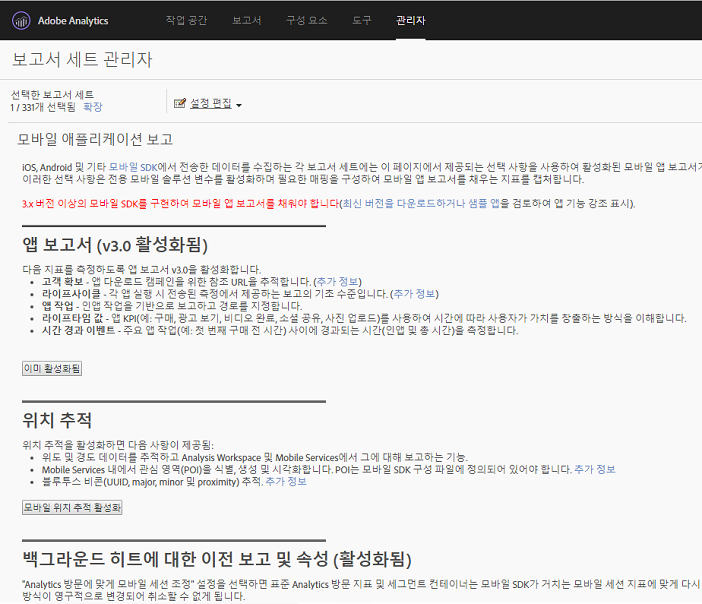

# Analytics {#analytics}

After you add the library to your project, you can make any of the Analytics method calls anywhere in your app.

>[!TIP]
>
>Ensure that you import  to your class.`ADBMobile.h`

## Enable mobile application reports in Analytics {#section_F2F9234009184F20BA36B5CDE872B424}

코드를 추가하기 전에, 모바일 앱 라이프사이클 추적을 사용하도록 설정하려면 Analytics 관리자가 다음을 완료하도록 하십시오. 이렇게 하면 개발을 시작할 때 보고서 세트가 메트릭을 캡처할 준비를 합니다.

1. Open **[!UICONTROL Admin Tools]** &gt; **[!UICONTROL Report Suites]** and select your mobile report suite(s).

1. Click **[!UICONTROL Edit Settings]** &gt; **[!UICONTROL Mobile Management]** &gt; **[!UICONTROL Mobile Application Reporting]**.

   

1. **[!UICONTROL 최신 앱 보고서 사용을 클릭합니다]**.

   Optionally, you can also click **[!UICONTROL Enable Mobile Location Tracking]** or **[!UICONTROL Enable Legacy Reporting and Attribution for background hits]**.

   

이제 라이프사이클 지표를 캡처할 준비가 되었으며, 마케팅 보고서 인터페이스의 보고서 메뉴에 **모바일 애플리케이션 보고서**&#x200B;가 표시됩니다.

### 새 버전

주기적으로 모바일 애플리케이션 보고의 새 버전이 출시됩니다. 새 버전은 보고서 세트에 자동으로 적용되지 않습니다. 업그레이드를 수행하려면 이러한 단계를 반복해야 합니다. 앱에 새로운 Experience Cloud 기능을 추가할 때마다 이러한 단계를 반복하여 최신 구성이 있는지 확인하는 것이 좋습니다.

## Lifecycle metrics {#section_532702562A7A43809407C9A2CBA80E1E}

앱에서 라이프사이클 메트릭을 수집하려면 애플리케이션이 다음 예제에 표시된 대로 활성화될 때 호출을 추가하십시오.

### WinJS in default.js

```js
app.onactivated = function (args) { 
  if (args.detail.kind === activation.ActivationKind.launch) { 
   ... 
   // launched and resumed stuff  
   ADBMobile.Config.collectLifecycleData(); 
  } 
}; 
app.oncheckpoint = function (args) { 
  ADBMobile.Config.pauseCollectingLifecycleData(); 
}
```

### App.xaml.cs의 C#

```js
public App() 
{ 
    this.InitializeComponent(); 
    this.Resuming += OnResuming; 
    this.Suspending += OnSuspending; 
} 
protected override void OnLaunched(LaunchActivatedEventArgs e) 
{   ... 
    ADBMobile.Config.CollectLifecycleData(); 
    ... 
} 
private void OnResuming(object sender, object e) 
{ 
    ... 
    ADBMobile.Config.CollectLifecycleData(); 
    ... 
} 
private void OnSuspending(object sender, SuspendingEventArgs e) 
{ 
    ... 
    ADBMobile.Config.PauseCollectingLifecycleData(); 
    ... 
}
```

### App.xaml.cpp의 C++/CX

```js
App::App() 
{ 
 InitializeComponent(); 
 Resuming += ref new EventHandler<Object ^>(this, &App::OnResuming); 
 Suspending += ref new SuspendingEventHandler(this, &App::OnSuspending); 
} 
void App::OnResuming(Object ^sender, Object ^args) 
{ 
 ... 
 ADBMobile::Config::CollectLifecycleData(); 
 ... 
} 
void App::OnSuspending(Object^ sender, SuspendingEventArgs^ e) 
{ 
 ... 
 ADBMobile::Config::PauseCollectingLifecycleData(); 
 ... 
} 
void App::OnLaunched(Windows::ApplicationModel::Activation::LaunchActivatedEventArgs^ e) 
{ 
 ... 
 ADBMobile::Config::CollectLifecycleData(); 
 ... 
}
```

If `CollectLifecycleData()` is called twice in the same session, your application reports a crash on every call after the first. SDK는 애플리케이션이 성공적으로 종료되었을 때 플래그를 설정합니다. If this flag is not set, `CollectLifecyleData()` reports a crash.

## Events, props, and eVars {#section_76EA6F5611184C5CAE6E62956D84D7B6}

If you've looked at [SDK methods](/help/universal-windows/c-configuration/methods.md), you are probably wondering where to set events, eVars, props, heirs, and lists. 버전 4에서는 더 이상 이러한 유형의 변수를 앱에서 직접 할당할 수 없습니다. 대신 SDK는 컨텍스트 데이터 및 처리 규칙을 사용하여 Analytics 변수에 앱 데이터를 매핑하여 보고합니다.

처리 규칙은 몇 가지 장점을 제공합니다.

* 앱 스토어에 업데이트를 제출하지 않고도 데이터 매핑을 변경할 수 있습니다.
* 보고서 세트와 관련된 변수를 설정하는 대신 의미 있는 이름을 데이터에 사용할 수 있습니다.
* 추가 데이터를 보내는 작업에는 거의 영향을 미치지 않습니다. 이러한 값은 처리 규칙을 사용하여 매핑될 때까지 보고서에 표시되지 않습니다.

변수에 직접 할당한 값은 대신 컨텍스트 데이터에 추가해야 합니다.

## 처리 규칙 {#section_66EE762EEA5E4728864166201617DEBF}

처리 규칙은 컨텍스트 데이터 변수로 보내는 데이터를 보고용으로 evar, prop 및 기타 변수에 복사하는 데 사용됩니다.

[처리 규칙 교육](https://tv.adobe.com/embed/1181/16506/)(Summit 2013)

[처리 규칙 도움말](https://docs.adobe.com/content/help/en/analytics/admin/admin-tools/processing-rules/processing-rules.html)

[처리 규칙 사용 인증 받기](https://helpx.adobe.com/analytics/kb/processing-rules-authorization.html)

'네임스페이스'를 사용하여 컨텍스트 데이터 변수를 그룹화하십시오. 이렇게 하면 논리적 순서를 유지할 수 있습니다. 예를 들어 제품에 대한 정보를 수집할 경우 다음 변수를 정의할 수 있습니다.

```javascript
"product.type":"hat" 
"product.team":"mariners" 
"product.color":"blue"
```

컨텍스트 데이터 변수는 처리 규칙 인터페이스에서 알파벳순으로 정렬되어 동일한 네임스페이스에 있는 변수를 빠르게 확인할 수 있습니다.

컨텍스트 데이터 키의 이름을 지정할 경우 evar 또는 prop 번호를 사용하지 마십시오.

```js
"eVar1":"jimbo"
```

이렇게 하면 처리 규칙에서 일회 매핑을 수행할 때 *약간* 간편해질 수 있지만 디버깅 및 향후 코드 업데이트에서는 가독성이 떨어져 더 어려워질 수 있습니다. 대신 키와 값에 대한 설명이 포함된 이름을 사용하는 것이 좋습니다.

```js
"username":"jimbo"
```

카운터 이벤트를 정의하는 컨텍스트 변수는 값 '1'로 설정해야 합니다.

```js
"logon":"1"
```

상향 조정기 이벤트를 정의하는 컨텍스트 데이터 변수는 증분값을 가질 수 있습니다.

```js
"levels completed":"6"
```

>[!TIP]
>
>Adobe reserves the namespace . `a.` 이러한 제한 사항 외에 컨텍스트 데이터 변수는 충돌을 방지하기 위해 로그인 회사에서 고유해야 합니다.

## Products variable {#section_AFBA36F3718C44D29AF81B9E1056A1B4}

To set  in the mobile SDK, you must use a special syntax. *`products`* For more information, see Products variable.[](/help/universal-windows/analytics/products.md)

## (Optional) Enable offline tracking {#section_955B2A03EB854742BDFC4A0A3C287009}

To store hits when the device is offline, you can enable offline tracking in the [SDK methods](/help/universal-windows/c-configuration/methods.md) file. 오프라인 추적을 활성화하기 전에 구성 파일 참조에 설명된 타임스탬프 요구 사항에 주의하십시오.

## Geo-location and points of interest {#section_BAD34A8DD013454DB355121316BD7FD4}

지리적 위치를 사용하면 위치 데이터(위도/경도) 및 사전 정의된 관심 영역을 측정할 수 있습니다. Each `TrackLocation` call sends:

* 경도/위도 및 POI(`ADBMobileConfig.json` 구성 파일에 정의된 POI 내에 있는 경우).

   이 정보는 자동 보고를 위해 모바일 솔루션 변수로 전달됩니다.

* 중심으로부터 떨어진 거리 및 정확도 - 컨텍스트 데이터로 전달됨.

   처리 규칙을 사용하여 캡처합니다.

위치를 추적하려면:

```js
var ADB = ADBMobile; 
ADB.Analytics.trackLocation(37.75345, -122.33207, null);
```

`ADBMobileConfig.json` 구성 파일에 다음 POI가 정의된 경우:

```js
"poi" : [ 
            ["San Francisco",37.757144,-122.44812,7000], 
        ]
```

When the device location is determined to be within a 7000 meter radius of the defined point, an `a.loc.poi` context data variable with the value `San Francisco` is sent in with the `TrackLocation` hit. `a.loc.dist` 컨텍스트 변수도 정의된 좌표로부터 떨어진 거리(단위: 미터)와 함께 전송됩니다.

## Lifetime value {#section_D2C6971545BA4D639FBE07F13EF08895}

라이프타임 값을 통해 각 사용자의 라이프타임 값을 측정하고 타깃팅할 수 있습니다. `TrackLifetimeValueIncrease`를 사용하여 값을 보낼 때마다 값이 기존 값에 추가됩니다. 라이프타임 값은 장치에 저장되며 `GetLifetimeValue`를 호출하여 언제든지 검색할 수 있습니다. 이 값은 라이프타임 구매, 광고 보기, 비디오 전체 보기, 소셜 네트워크 공유, 사진 업로드 등을 저장하는 데 사용할 수 있습니다.

```js
// Lifetime Value Example 
var ADB = ADBMobile; 
var purchasePrice = 39.95; 
var cdata = new Windows.Foundation.Collections.PropertySet(); 
cdata["ItemPurchaseEvent"] = "ItemPurchaseEvent"; 
cdata["PurchaseItem"] = "Item453"; 
cdata["PurchasePrice"] = purchasePrice; 
ADB.Analytics.trackLifetimeValueIncrease(purchasePrice, cdata);
```

## Timed actions {#section_7FF8B6A913A0460EAA4CAE835E32D8C1}

시간 작업을 사용하면 작업의 시작과 끝 사이의 인앱 시간 및 총 시간을 측정할 수 있습니다. SDK는 세션에서 시간의 길이를 계산하고 작업 완료까지 걸리는 총 시간을 모든 세션에 걸쳐 계산합니다. 세그먼트를 정의하고 구매, 전달 수준, 체크아웃 플로우 등에 걸리는 시간을 비교하는 데 사용할 수 있습니다.

* 전체 세션 시작 및 종료 사이의 총 인앱 시간(초)
* 시작 및 종료 간 총 클록 시간 (초)

```js
// Timed Action Start Example 
var ADB = ADBMobile; 
var cdata = new Windows.Foundation.Collections.PropertySet(); 
cdata["ExperienceName"] = experience; 
ADB.Analytics.trackTimedActionStart("TimeUntilPurchase", cdata);
```

```js
// Timed Action Update Example 
var ADB = ADBMobile; 
var cdataUpdate = new Windows.Foundation.Collections.PropertySet(); 
cdataUpdate["ImageLiked"] = imageName; 
ADB.Analytics.trackTimedActionStart("TimeUntilPurchase", cdata); 
```

```js
// Timed Action End Example 
var ADB = ADBMobile; 
ADB.Analytics.trackTimedActionEnd("TimeUntilPurchase");
```
