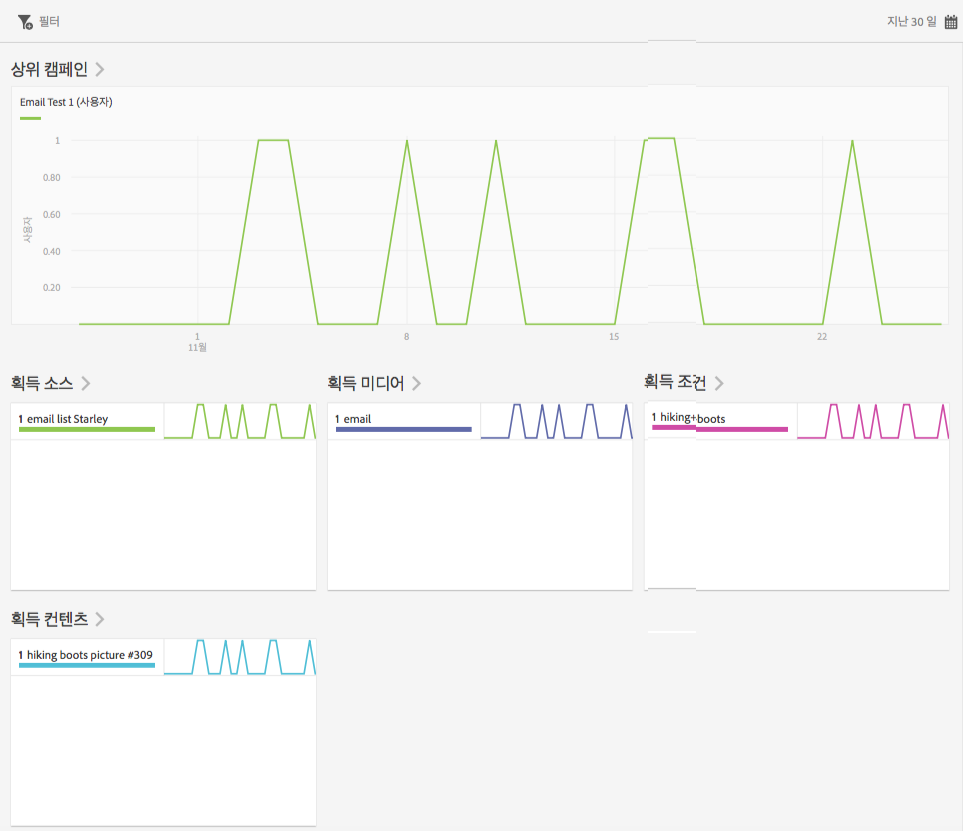
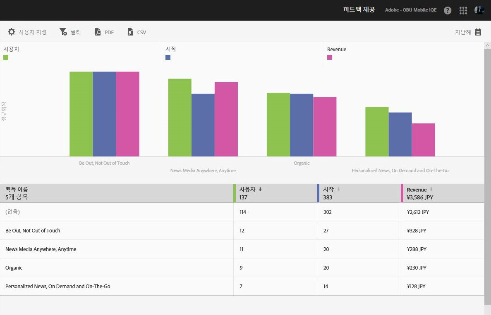

# 획득 {#acquisition}

마케터는 추적 링크를 만들어 앱을 홍보하고 앱으로의 트래픽을 유도할 수 있습니다. 이러한 추적 링크는 인앱 동작과 상관 관계가 있을 수 있는 앱스토어, 앱 딥링크 및 삽입 광고로 사용자를 유도할 수 있습니다. 마케터는 하나의 링크를 만들어 사용자를 iOS, Android 또는 기타 플랫폼으로 적절하게 라우팅할 수 있습니다. 

## 새로운 Adobe Experience Cloud SDK 릴리스

Adobe Experience Platform Mobile SDK와 관련된 정보 및 설명서를 찾고 계십니까? [여기](https://aep-sdks.gitbook.io/docs/)를 클릭하여 최신 설명서를 확인하십시오.

2018년 9월 일자로 SDK의 새로운 주요 버전을 릴리스하였습니다. 이러한 새로운 Adobe Experience Platform Mobile SDK는 [Experience Platform Launch](https://www.adobe.com/kr/experience-platform/launch.html)를 통해 구성할 수 있습니다.

* 시작하려면 [시작](https://launch.adobe.com/)으로 이동합니다.
* Experience Platform SDK 리포지토리의 항목을 보려면 [Github: Adobe Experience Platform SDK](https://github.com/Adobe-Marketing-Cloud/acp-sdks)로 이동하십시오.

>[!IMPORTANT]
>
> Adobe Experience Platform Mobile SDK와 Adobe Launch를 함께 사용 중인 경우, Adobe Analytics Mobile Services 확장 프로그램을 설치&#x200B;**해야** 획득 링크와 같은 Adobe Mobile Services 기능을 사용할 수 있습니다. 자세한 내용은 [Adobe Analytics - Mobile Services](https://aep-sdks.gitbook.io/docs/using-mobile-extensions/adobe-analytics-mobile-services)를 참조하십시오. Experience Cloud SDK와 함께 획득 및 마케팅 링크 사용에 대한 자세한 내용은 [획득 및 마케팅 링크](https://aep-sdks.gitbook.io/docs/using-mobile-extensions/adobe-analytics-mobile-services#acquisition-and-marketing-links)를 참조하십시오.

>[!IMPORTANT]
>
>UI에서 기능을 구성할 수 있지만, 이러한 기능은 생성된 구성 파일을 다운로드하고 이 파일을 SDK에 추가할 때까지 작동하지 않습니다. SDK 다운로드 및 구성에 대한 자세한 내용은 이 페이지의 *SDK 설명서* 섹션을 참조하십시오.

추적 가능한 모바일 앱 마케팅 링크에서 보고서를 생성, 편집, 관리하고 볼 수 있습니다.

>[!TIP]
>
>이 기능을 사용하려면 Adobe Analytics - 모바일 앱 또는 Adobe Analytics Premium SKU가 필요합니다.

다음 획득 보고서를 통해 마케팅 링크가 어떻게 작동하는지 파악할 수 있습니다.

* **개요** {#section_5B2BA47F22694919A472AB591101237E}

   이 보고서는 사용자를 앱으로 유도한 상위 캠페인을 표시하고, 획득 소스, 매체, 용어 및 컨텐츠와 같은 다른 추적 메타데이터에서 이들 캠페인이 어떤 성과를 보였는지에 대한 정보도 함께 표시합니다.

   

* **링크 보고서** {#section_A23A640C363B43569D9D484CF49EA277}

   이 보고서는 마케팅 링크 성과에 대한 등급 보기를 제공합니다. 링크 이름 옆에 주요 성과 지표를 표시하는 것 외에도 보고서 양식을 사용자 지정할 수 있습니다. 자세한 내용은 [보고서 사용자 지정](/help/using/usage/reports-customize/t-reports-customize.md)을 참조하십시오.

   다음 정보를 숙지하십시오.

   * 열 헤더에서 화살표 아이콘을 클릭하여 데이터를 오름차순이나 내림차순으로 정렬할 수 있습니다.
   * PDF 문서로 데이터를 내보내려면 **[!UICONTROL 다운로드를 클릭하면 됩니다]**.
   
