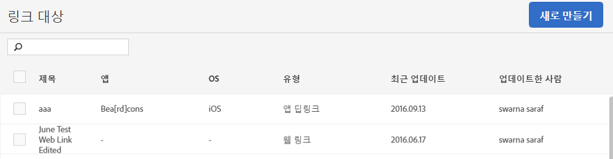

# 링크 대상 만들기 및 관리{#create-and-manage-link-destinations}

링크 대상 관리 페이지에서 링크 대상을 작성, 편집, 보관/보관 해제 및 삭제할 수 있습니다. 이러한 대상을 만들면 마케팅 링크, 푸시 알림 또는 인앱 메시지를 작성할 때 인라인으로 호출할 수 있습니다.

링크 대상 관리 페이지를 표시하려면 다음 단계를 따르세요. 

1. 왼쪽 탐색 메뉴에서 **[!UICONTROL 앱 관리를 클릭합니다]**.
1. 앱 이름을 클릭하여 해당 앱 정보 페이지를 표시합니다.
1. 오른쪽 상단에서 **[!UICONTROL 링크 대상 관리를 클릭합니다]**.

링크 대상 페이지에 링크 대상과 함께 링크 대상을 작성, 보관, 보관 해제, 편집 및 삭제할 수 있는 옵션이 표시됩니다.

예:

