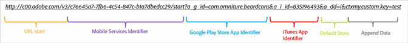
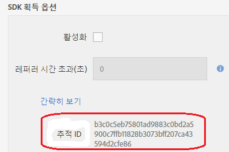

# 획득 링크 수동으로 만들기 {#create-acquisition-link-manually}

URL 매개 변수를 수동으로 구성하여 새 모바일 앱 사용자를 즉석에서 확보하는 마케팅 링크를 만들 수 있습니다.

>[!IMPORTANT]
>
>이 기능을 사용하려면 SDK 버전 4.6 이상이 필요합니다. 자세한 내용은 [획득 전제 조건을](/help/using/acquisition-main/c-acquisition-prerequisites.md)참조하십시오.

다음 다이어그램은 수동으로 작성한 추적 링크의 구성 요소를 보여주며 획득 링크를 수동으로 만들 때 적절히 구성해야 하는 다양한 URL 매개 변수를 표시합니다.

이 링크는 모바일 앱용 Google Play 스토어 또는 Apple App Store로 플랫폼별 리디렉션을 수행하도록 구성되었습니다. 대상을 결정할 수 없을 경우 기본 스토어는 Apple App Store로 설정되었습니다. 앱이 설치되면 `my.custom.key:test` 사용자 지정 컨텍스트 키가 Analytics 설치 히트에 첨부됩니다.

링크를 수동으로 작성하려면 다음 URL 형식을 사용하십시오.

`http(s)://c00.adobe.com/v3/ {mobile-services-app-hash}/start? {parameters}`

>[!TIP]
>
>사용 중인 Android SDK 버전은 이 프로세스에 영향을 주지 않습니다.

iOS의 경우 올바른 프로토콜을 사용하는지 확인합니다.

* Use **HTTP** if you are using the iOS SDKs before version 4.7.0, or if you are using iOS SDK 4.7.0 or later, and if **[!UICONTROL Use HTTPS]** is **not** selected on the Manage App Settings page.
* Use **HTTPS** if you are using iOS SDK 4.7.0 or later and **[!UICONTROL Use HTTPS]** **is** selected on the Manage App Settings page.

이때 다음 조건이 충족됨:

* `{mobile-services-app-hash}` 구성 `acquisition:appid ` 파일의 응용 프로그램 식별자와 일치합니다.

   You can locate `{mobile-services-app-has}` in the Manage App Settings page under Acquisition SDK Options in the Tracking ID field.

   

* `{parameters}` 은 특별히 URL 쿼리 매개 변수라는 이름의 표준 목록입니다.

다음은 매개 변수 목록입니다.

* **`a_g_id`**

   Google Play 스토어 앱 식별자.

   * 샘플 값: `com.adobe.beardcons`

* **`a_g_lo`**

   Google Play 스토어 로케일 재정의.

   * 샘플 값: `ko`

* **`a_i_id`**

   iTunes 앱 식별자.

   * 샘플 값: `835196493`

* **`a_i_lo`**

   iTunes 로케일 재정의.

   * 샘플 값: `jp`

* **`a_dd`**

   자동 리디렉션을 위한 기본 스토어.

   * 샘플 값: `i | g`

* **`a_cid`**

   사용자 지정 ID 재정의(일반적으로 iOS용 IDFA 또는 Android용 ADID).

   * 샘플 값: `Any String < 255 characters (UTF-8 encoded)`

* **`ctx*`**

   접두사가 앞에 붙는 키는 `ctx` 결과 론치 히트의 컨텍스트 데이터에 있게 됩니다.

   * 샘플 값: `ctxmy.custom.key=myValue`

* **`ctxa.referrer.campaign.name`**

   획득 캠페인 이름.

   이 매개 변수는 다른 획득 링크의 성과를 비교하려는 경우 보고에 필요합니다.

   * 샘플 값: 2015 Summit Conference

* **`ctxa.referrer.campaign.trackingcode`**

   추적 코드

   이 매개 변수는 다른 획득 링크의 성과를 비교하려는 경우 보고에 필요합니다.

   * 샘플 값: `lexsxouj`

* **`ctxa.referrer.campaign.source`**

   소스.

   * 샘플 값: 광고 네트워크

* **`ctxa.referrer.campaign.medium`**

   보통

   * 샘플 값: 이메일

* **`ctxa.referrer.campaign.content`**

   컨텐츠

   * 샘플 값: image # 325689

* **`ctxa.referrer.campaign.term`**

   용어

   * 샘플 값: Hiking + Boots

획득 링크를 수동으로 만들 때는 다음 정보를 기억하십시오.

* 표에 있는 매개 변수와 일치하지 않는 매개 변수는 모두 앱스토어 리디렉션의 일부로 전달됩니다.
* 하나 이상의 스토어 ID가 지정되면 링크가 작동하지 않지만 모든 매개 변수는 기술적으로 선택 사항입니다.

   An example of a store ID is `a_g_id`/ `a_i_id`.

* 대상 스토어를 자동으로 확인할 수 없고 기본값을 제공하지 않으면 404 오류가 반환됩니다.

