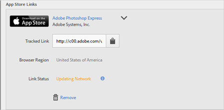

# 획득 링크 만들기{#create-an-acquisition-link}

Apple App Store 및 Google Play에서 바로 응용 프로그램을 다운로드할 수 있는 앱스토어 링크를 만들 수 있습니다. 이 링크를 만들면 다운로드 이벤트를 성공시킬 수 있습니다.

1. **[!UICONTROL 획득]** > **[!UICONTROL 획득 링크 관리]** > **[!UICONTROL 새로 만들기]**&#x200B;를 클릭합니다.
1. **[!UICONTROL 링크 정보]** 섹션에 다음 정보를 입력합니다.

   * (**필수**) **[!UICONTROL 이름]** 앱 링크를 설명하는 이름을 지정합니다.
   * **[!UICONTROL 추적 코드]** 원하는 추적 코드를 지정하거나 **[!UICONTROL 생성]**&#x200B;을 클릭하여 새 추적 코드를 만듭니다.
   * (**필수**) **[!UICONTROL 소스]** &quot;뉴스레터&quot; 또는 &quot;홈 페이지&quot;와 같은 원본 레퍼러를 지정합니다.
   * **[!UICONTROL 매체]**
&quot;배너&quot; 또는 &quot;이메일&quot;과 같은 마케팅 매체를 지정합니다.
   * **[!UICONTROL 콘텐츠]**
링크가 있는 광고의 이름이나 ID를 지정합니다.
   * **[!UICONTROL 용어]**
광고의 유료 용어나 기타 검색어를 지정합니다.
   >[!IMPORTANT]
   >
   >획득 링크가 만들어진 후에는 위 필드의 값을 변경할 수 없습니다.

1. **[!UICONTROL 앱스토어 링크 추가]** 섹션의 필드에 정보를 입력합니다.

   * **[!UICONTROL 앱스토어]**

      앱스토어를 선택합니다.
      * Apple App Store
      * Google Play

      아래에 설명된 대로 각 앱스토어에 대한 옵션은 다릅니다.

   * **[!UICONTROL 브라우저 지역(Apple App Store만 해당)]**

      데스크톱 브라우저에 대한 특정 지역 앱스토어를 지정합니다.

      이 설정을 사용하면 사용자가 데스크톱 브라우저에서 링크를 클릭할 때 획득 링크가 가리킬 지역별 앱스토어를 정의할 수 있습니다. 모바일 장치는 장치 설정에 따라 자동으로 리디렉션합니다.

   * **[!UICONTROL 브라우저 언어(Google 언어(Google Play만 해당))]**

      드롭다운 목록에서 언어를 선택합니다.

      이 설정을 지정하여 데스크톱 브라우저용으로 Google Play Store에서 표시할 특정 언어를 정의할 수 있습니다. 모바일 장치에서는 장치 설정에 따라 언어가 표시됩니다.

   * **[!UICONTROL 이름별로 검색]**

      * Apple App Store의 경우 앱 ID를 모르면 이름으로 앱을 검색할 수 있습니다.

         **[!UICONTROL 지역]** 드롭다운 목록에서 원하는 지역을 선택하여 검색을 제한할 수 있습니다.

      * Google Play의 경우 패키지 이름을 모르면 이름으로 앱 이름을 검색할 수 있습니다.
   * **[!UICONTROL 앱 ID(Apple App Store만 해당)]**

      앱을 검색하면 이 필드가 자동으로 완성됩니다. 앱을 검색하는 대신 앱 ID 값을 직접 입력할 수 있습니다.

   * **[!UICONTROL 패키지 이름(Google Play만 해당)]**

      앱을 검색하면 이 필드가 자동으로 완성됩니다. 패키지 이름 값을 검색하는 대신 직접 입력할 수도 있습니다.

1. 구성을 저장하고 링크를 생성하려면 **[!UICONTROL 추가]** > **[!UICONTROL 저장]**&#x200B;을 클릭합니다.

   새로 만든 링크가 **[!UICONTROL 앱스토어 링크]** 섹션에 표시됩니다.

   

1. 을 클릭하여 추적한 링크를 클립보드에 복사합니다.

1. 소셜 미디어 게시물, 광고, 이메일 메시지 등에 이 링크를 붙여넣습니다.