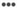

# Create or edit marketing links{#create-or-edit-marketing-links}

You can create or edit Marketing Links to provide deep linking to your mobile app or your website. For more information, see Apple Universal Links and Android App Links.

1. In your app, in the left navigation pane, expand **[!UICONTROL Acquisition]** and click **[!UICONTROL Marketing Link Builder]**.
1. 다음 작업 중 하나를 완료하십시오.

   * To create a Marketing Link, click **[!UICONTROL Create New]**.
   * 링크를 편집하려면 **[!UICONTROL 제목]열에서 링크 이름을 클릭합니다.**

1. 다음 필드에 정보를 입력하십시오.

   * **[!UICONTROL 마케팅 링크 이름]**:

      (**Required**) Specify a descriptive name for your Marketing Link. 이 이름은 Adobe Mobile Services UI의 마케팅 링크 페이지에만 표시됩니다. 수사적 이름은 작성자나 조직의 다른 직원이 특정 링크를 신속하게 찾을 수 있게 하고 링크를 만든 목적에 대한 자세한 설명을 제공합니다.

   * **[!UICONTROL 고유한 추적 코드]**:

      (**Required**) Specify the desired tracking code or click ( to create a new tracking code. 추적 코드 사용에 관한 자세한 내용이 담긴 보고서를 볼 수 있습니다.

   * **[!UICONTROL 추적 컨텍스트 데이터 추가]**:

      (**Optional**) Click the **[!UICONTROL +]** icon and type the relevant information to track your campaign using context data. **[!UICONTROL 사용자 지정 컨텍스트 데이터]드롭다운 목록에서 사전 설정된 태그 또는 고유한 태그 중 하나를 선택합니다.** 컨텍스트 데이터는 마케팅 링크가 배포된 경우 보고에 사용됩니다.

      다음 사전 설정 태그를 사용할 수 있습니다.

      * **Custom Context Data
Specify the key and value.** 사용자 지정 컨텍스트 데이터를 추가할 경우 처리 규칙을 작성해야 합니다. For more information, see Processing rules overview.

      * **소스원래**&#x200B;레퍼러(예: "뉴스레터" 또는 "홈 페이지")를 지정합니다.

      * **Medium**
Specify the marketing medium, such as "banner" or "email."

      * **컨텐츠**&#x200B;링크와 함께 광고의 이름이나 ID를 지정합니다.

      * **용어**&#x200B;광고의 유료 용어 또는 기타 검색어를 지정합니다.
1. **[!UICONTROL 저장]**&#x200B;을 클릭합니다.
1. 다음 필드에 정보를 입력하십시오.

   * **(필수)** 대체 **[!UICONTROL URL]**&#x200B;에서 대상을 일치시킬 수 없을 때 사용자에게 안내되는 URL을 지정합니다(예: 사용자가 데스크톱 또는 대상 규칙과 일치하지 않는 다른 플랫폼에 있는 경우).
   * **[!UICONTROL 마케팅 링크 옵션]**&#x200B;에서 **[!UICONTROL 삽입 광고]** 또는 **범용 및 앱 링크[!UICONTROL 를 선택합니다]**.

      For more information, see Interstitials or Apple Universal Links and Android App Links.

   * **(조건부)** 유니버설 **[!UICONTROL 또는 앱]** 링크를 **[!UICONTROL 선택한 경우 사용자 지정]**&#x200B;경로에서사용자는 쿼리 매개 변수를 사용하여 도메인 다음에 URL 경로를 정의할 수 있습니다. For more information, see Apple Universal Links and Android App Links.

1. Click **[!UICONTROL Edit Deep Link Interstitial]** and configure the link.

   (**Optional**) When there are multiple destinations, users can be routed depending on whether they have a mobile app installed. 앱이 설치되어 있는 경우 삽입 광고 랜딩 페이지가 표시됩니다.

   자세한 내용은 [중간 광고](/help/using/acquisition-main/c-marketing-links-builder/t-create-edit-adobe-links/t-interstitials.md).

1. Click **[!UICONTROL Save]** and click **[!UICONTROL Next]**.
1. 대상 페이지에서 링크를 구성합니다.

   1. Click the **[!UICONTROL Decision]** icon () and select one of the following decision locations:

      * **[!UICONTROL 결정 추가]**
      * **[!UICONTROL 경로 추가]**
   1. If you selected **[!UICONTROL Add Decision]**, select one of the following decision types:

      * **[!UICONTROL 운영 결정]**

         지원되는 운영 체제는 iOS, Android, AMX 등입니다.

      * **[!UICONTROL 장치 유형]**

         장치 유형에는 데스크톱, eReader, 게임 콘솔, 휴대 전화, 셋톱 박스 등과 같은 장치가 있습니다.
   1. Click the **[!UICONTROL Destination]** icon (  ) and select one of the following destination types:

      * **[!UICONTROL 앱스토어]**
      * **[!UICONTROL 웹 링크]**
      * **[!UICONTROL 앱 딥링크]**
      * **[!UICONTROL 하이브리드 링크]**
      >[!TIP]
      >
      >When you use the **[!UICONTROL Web Link]** destination type with a link to the app store, acquisition is not tracked. 획득을 추적하려면 **[!UICONTROL 앱스토어]대상 유형을 사용합니다.**

      For more information, see Create a new link destination.

1. To save the Marketing Link, click elipses and then Save.****
