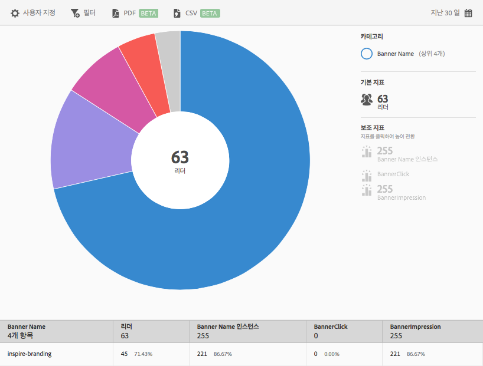

# 배너 지표 {#banner-metrics}

**[!UICONTROL 배너 지표]보고서에는 기존 데이터에 대한 선버스트 시각화가 표시됩니다.** 이 보고서는 DPS(Digital Publishing Suite) 고객에게만 제공됩니다.

기본적으로 이 보고서에는 다음 지표가 표시됩니다.

* **[!UICONTROL 배너 이름]**: 배너 이름입니다.
* **[!UICONTROL 리더 수]**: 앱 사용자 수입니다.
* **[!UICONTROL Banner Name Instances]**, which is the number of times the banner was referenced through clicks and impressions.
* **[!UICONTROL 배너 클릭 수]**: 사용자가 배너를 클릭한 횟수입니다.
* **[!UICONTROL 배너 노출 횟수]**: 브라우저 페이지에서 배너를 본(또는 표시된) 횟수입니다.

이 보고서는 **[!UICONTROL 기술]보고서와 유사합니다.** For information about how to navigate and use sunburst reports; add breakdowns and metrics; create target activities; create sticky filters, and share reports, see [Technology](/help/using/usage/reports-technology.md). 이 항목의 정보는 **[!UICONTROL 배너 지표]보고서를 사용자 지정하는 데 사용할 수 있습니다.**
