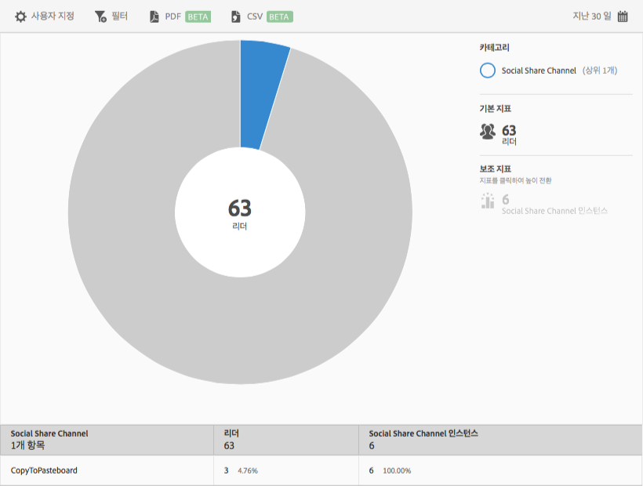

# 소셜 공유{#social-sharing}

**[!UICONTROL 소셜 공유]** 보고서에는 기존 데이터에 대한 선버스트 시각화가 표시됩니다. 이 보고서는 DPS 고객만 사용할 수 있습니다.

기본적으로 이 보고서에는 다양한 채널(이메일, 메시지 등)에서 문서를 공유한 리더의 수가 표시됩니다.

이 보고서는 **[!UICONTROL 기술]** 보고서와 유사합니다. 선버스트 보고서 탐색 및 사용, 분류 및 지표 추가, 타겟 활동 만들기, 고정 필터 만들기 및 보고서 공유 방법에 대한 자세한 내용은 [토폴로지](/help/using/usage/reports-technology.md)를 참조하십시오. 기술 항목의 정보는 **[!UICONTROL 소셜 공유]** 보고서를 사용자 지정하는 데 사용할 수 있습니다.
