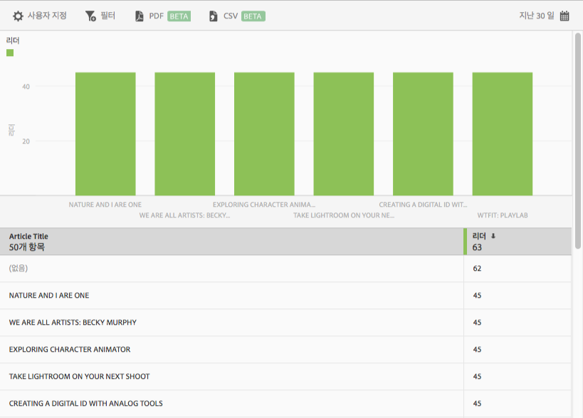

# 상위 50개 문서 보고서{#top-articles}

**[!UICONTROL 상위 50개 문서]** 보고서에는 해당 앱을 사용하여 표시된 가장 많이 읽은 문서를 보여주는 막대 차트와 등급 보고서가 표시됩니다. 이 보고서는 DPS 고객만 사용할 수 있습니다.

기본 보고서에는 리더 수별로 마지막 30일 동안의 데이터가 표시되지만, 보고서를 사용자 지정할 수 있습니다.

기본적으로 이 보고서에는 문서 제목과 독자 수가 표시됩니다.

이 보고서에 대해 다음 옵션을 구성할 수 있습니다.

* **[!UICONTROL 기간]**
**[!UICONTROL 달력]** 아이콘을 클릭하여 사용자 지정 기간을 선택하거나 드롭다운 목록에서 사전 설정된 기간을 선택합니다.

* **[!UICONTROL 사용자 지정]**

   **[!UICONTROL 표시 기준]** 옵션 변경, 지표 및 필터 추가, 시리즈(지표) 추가 등을 통해 보고서를 사용자 지정합니다. 자세한 내용은 [보고서 사용자 지정](/help/using/usage/reports-customize/reports-customize.md)을 참조하십시오.

* **[!UICONTROL 필터]**

   **[!UICONTROL 필터]**&#x200B;를 클릭하면 다른 보고서에 적용되는 필터를 생성하여 세그먼트가 모든 모바일 보고서에서 어떻게 작동하는지 확인할 수 있습니다. 고정 필터를 사용하면 경로 지정 외의 모든 보고서에 적용되는 필터를 정의할 수 있습니다. 자세한 내용은 [고정 필터 추가](/help/using/usage/reports-customize/t-sticky-filter.md)를 참조하십시오.

* **[!UICONTROL 다운로드]**

   **[!UICONTROL PDF]**&#x200B;나 **[!UICONTROL CSV]**&#x200B;를 클릭하여 문서를 다운로드하거나 열고, Mobile Services에 대한 액세스 권한이 없는 사용자와 공유하거나 프레젠테이션의 파일을 사용할 수 있습니다.