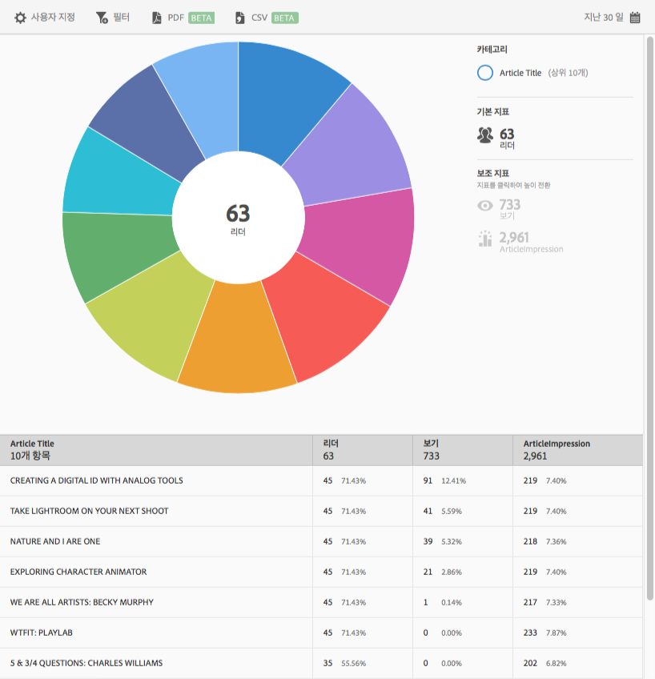

# Top 10 Articles report{#top-articles}

The **[!UICONTROL Top 10 Articles]** report displays a sunburst visualization for your data. This report is available only to DPS customers.

기본적으로 이 보고서에는 문서 제목, 리더 수, 총 리더 수의 비율 및 문서 제목 인스턴스 수 및 비율이 표시됩니다.

이 보고서는 **[!UICONTROL 기술]보고서와 유사합니다.** For information about how to navigate and use sunburst reports, add breakdowns and metrics, create target activities, create sticky filters, and share reports, see [Technology](/help/using/usage/reports-technology.md). This information can be used to customize the Top 10 Articles report.****
