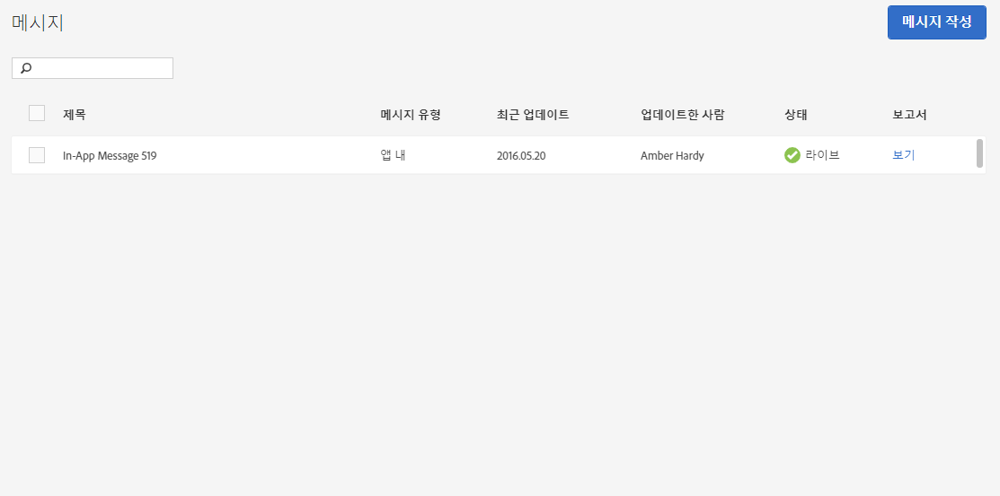

# 메시지 관리{#manage-messages}

각 메시지가 마지막으로 업데이트된 시간 및 메시지가 활성 상태인지 아니면 비활성화되었는지에 대한 세부 정보가 포함된 인앱 푸시 메시지 목록을 봅니다.

메시지를 복제하거나 활성화 또는 비활성화, 아카이브 또는 아카이브 해제할 수 있습니다. 메시지를 본 사용자 수와 메시지를 통해 클릭한 사용자 수를 표시하는 보고서를 볼 수도 있습니다.

메시지를 관리하려면, ***your_app_name*** > **[!UICONTROL 메시징]** > **[!UICONTROL 메시지 관리]**&#x200B;를 클릭합니다.

다음은 메시지에서 완료할 수 있는 작업에 대한 추가 정보입니다.

* **메시지 검색 및 필터링**

   목록 상단의 검색 상자를 사용하여 메시지를 검색하고 필터링합니다. 검색 상자에 입력하는 모든 내용은 목록에서 일치하는 메시지를 표시합니다. 모든 표 열에서 검색이 작동합니다. 예를 들어, 해당 상태의 메시지만 표시하도록 `Draft`를 입력할 수 있습니다. 사용자 이름을 입력하면 해당 사용자가 업데이트한 메시지만 표시됩니다.

   검색 상자 외에도 임의의 열 헤더를 클릭하여 해당 열의 내용을 기준으로 하여 목록을 오름차순 또는 내림차순으로 정렬할 수도 있습니다.

   예를 들어 **[!UICONTROL 메시지 유형]** 열을 오름차순으로 정렬하는 경우 모든 인앱 메시지가 푸시 메시지보다 앞에 표시됩니다. **[!UICONTROL 최근 업데이트]** 열을 내림차순으로 정렬하면 가장 최근 업데이트된 메시지가 목록 맨 위에 표시됩니다.

* **메시지 복제**

   1. 하나 이상의 메시지 옆에 있는 확인란을 선택하고 **[!UICONTROL 선택한 복제를 클릭합니다]**.
   1. 중복 메시지를 만들 앱을 선택합니다.
   1. 메시지의 이름을 입력합니다.

      동일한 앱에 대한 메시지를 복제하려면 메시지의 새 이름을 입력합니다. 원래 메시지를 덮어쓰려면 동일한 이름을 유지합니다. 다른 앱에 대한 메시지를 복제하는 경우, 원래 메시지를 덮어쓰지 않고 동일한 이름을 유지할 수 있습니다.

   1. 필요에 따라 **[!UICONTROL 복제]** 또는 **[!UICONTROL 덮어쓰기]**&#x200B;를 클릭합니다.

* **메시지 활성화 또는 비활성화**

   메시지를 비활성화하려면 적어도 한 개의 활성 메시지 옆에 있는 확인란을 선택하고 **[!UICONTROL 선택한 항목 비활성화를 클릭합니다]**.

   비활성화된 메시지를 활성화하려면 적어도 한 개의 비활성화된 메시지 옆에 있는 확인란을 선택하고 **[!UICONTROL 선택한 항목 활성화를 클릭합니다]**.

* **메시지 아카이브**

   메시지를 보관하고 메시지 목록을 정리하려면 다음을 수행합니다.

   >[!TIP]
   >
   >메시지를 보관하기 전에 먼저 비활성화해야 합니다.

   1. 적어도 한 개의 비활성화된 메시지 옆에 있는 확인란을 선택하고 **[!UICONTROL 선택한 아카이브를 클릭합니다]**.

* **아카이브된 메시지 보기**

   1. **[!UICONTROL 아카이브 보기를 클릭합니다]**.
   1. 적어도 한 개의 보관된 메시지 옆에 있는 확인란을 선택하고 **[!UICONTROL 선택한 아카이브 해제를 클릭합니다]**.

