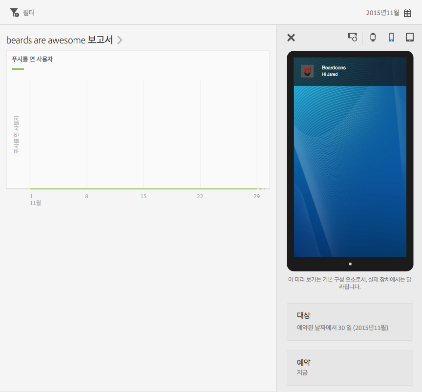
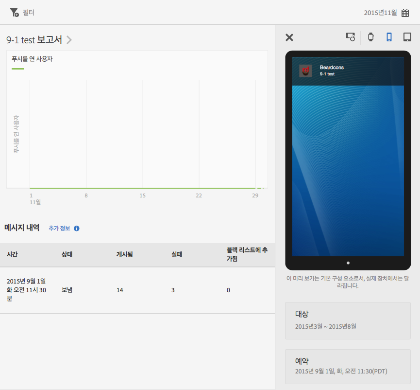

# 메시지 보고서 보기{#view-message-reports}

인앱 및 푸시 메시지에 대한 메시지 보고서를 볼 수 있습니다.

1. 메시지에 대한  열에서 **[!UICONTROL 보고서 아이콘]**&#x200B;을 클릭합니다.
1. (**선택 사항**) 보고서에 대한 고정 필터를 만들거나, **[!UICONTROL 달력]** 아이콘을 클릭하여 기간을 변경합니다.

   고정 필터 만들기에 대한 자세한 내용은 [고정 필터 추가](/help/using/usage/reports-customize/t-sticky-filter.md)를 참조하십시오.

>[!TIP]
>
>표시된 메시지 유형에 따라 보고서가 달라질 수 있습니다.

## 인앱 메시지 {#section_90B79BA58E8141F78538C187EB1BF8C7}

인앱 메시지에 대한 보고서를 표시하는 경우 보고서는 아래 그림과 유사합니다.

### 인앱 메시지 지표

다음은 인앱 메시지에 사용할 수 있는 지표 목록입니다.

* **[!UICONTROL 노출 횟수]**: 메시지가 트리거되는 경우입니다.

* **[!UICONTROL 클릭스루]**: 사용자가 경고 또는 전체 화면 메시지에서 **[!UICONTROL 클릭스루]** 단추를 누르는 경우 및 사용자가 로컬 알림에서 앱을 여는 경우입니다.

* **[!UICONTROL 취소]**: 사용자가 경고 또는 전체 화면 메시지에서 **[!UICONTROL 취소]** 단추를 누르는 경우입니다.

* **[!UICONTROL 참여 비율]**: Adobe Analytics에서 계산된 지표이며, 클릭스루 수를 노출 횟수로 나눈 결과입니다.

## 푸시 메시지 {#section_BEAFD858CA194185B6F88903446058E9}

푸시 메시지에 대한 보고서를 표시하는 경우 보고서는 아래 그림과 유사합니다.

맨 위의 차트에는 메시지를 연 사용자의 수가 표시됩니다.

### 푸시 메시지 지표

다음은 푸시 메시지에 사용할 수 있는 지표 목록입니다.

* **[!UICONTROL 시간]**

   메시지가 Mobile Services에서 장치에 푸시된 시간입니다.

* **[!UICONTROL 상태]**

   메시지의 상태 및 사용 가능한 상태는 다음과 같습니다.

   * **[!UICONTROL 취소됨]**
   * **[!UICONTROL 예약됨]**
   * **[!UICONTROL 실행 중]**
   * **[!UICONTROL 실행됨]**

* **[!UICONTROL 게시됨]**

   사용자 장치로 메시지를 전송하기 위해 APNS/FCM(Apple 푸시 알림 서비스/Firebase Cloud Messaging)으로 성공적으로 전송된 장치 토큰 수입니다.

* **[!UICONTROL 실패]**

   APNS/FCM으로 전송되지 않은 장치 토큰 수입니다. 몇 가지 가능한 실패 원인은 다음과 같습니다.

   * 유효하지 않은 pushID

   * 푸시에 제공된 푸시 플랫폼(APNS, FCM 등)이 작업 애플리케이션에 존재하지 않습니다. 예를 들어, 플랫폼은 iOS 푸시 토큰을 수집할 수 있지만 APNS 서비스가 구성되어 있지 않습니다.

   * 푸시 서비스가 올바르게 구성되지 않았거나 Mobile Services 시스템이 다운되어 메시지가 실패했을 수 있습니다.
   >[!IMPORTANT]
   >
   >특히 오류가 많은 경우 푸시 서비스 구성을 확인하십시오. 푸시 서비스가 올바르게 구성된 경우 Adobe 고객 지원 센터에 문의하십시오.

* **[!UICONTROL 차단 목록에 추가됨]**

   더 이상 APNS 또는 FCM으로 전송하기에 유효하지 않은 장치 토큰 수입니다. 이는 보통 앱이 장치에서 제거되었거나 사용자가 메시지를 수신하기 위한 옵트인 설정을 변경했다는 의미입니다. Android와 iOS에서는 토큰이 차단 목록으로 계산되는 시기와 다릅니다. Android 토큰은 즉시 차단 목록 수에 표시됩니다. iOS 토큰은 처음에 게시됨으로 표시되지만 APNS의 피드백을 기반으로 후속 메시지에 차단 목록에 추가됨으로 표시됩니다.
