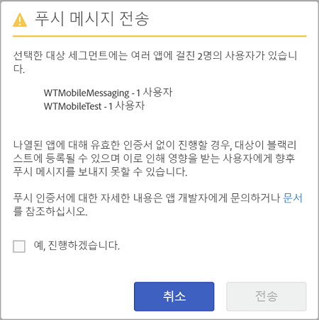

# 대상: 푸시 메시지{#audience-define-and-configure-audience-segments-for-push-messages}

푸시 메시지에 대해 날짜 범위 옵션, Analytics 세그먼트 및 사용자 지정 세그먼트 등의 대상 옵션을 정의하고 구성할 수 있습니다.

## 대상 세그먼트 정의 {#section_7C4D2393CF7441959FE2381A02867CAC}

푸시 메시지를 위한 대상 세그먼트가 만들어지면 보고서 세트 또는 가상 보고서 세트에 하나 이상의 앱의 데이터가 포함될 수 있으므로 이 세그먼트에는 하나 이상의 앱의 사용자가 포함될 수 있습니다. 가상 보고서 세트에 대한 자세한 내용은.[가상 보고서 세트](/help/using/manage-apps/c-mob-vrs.md)를 참조하십시오.

Adobe Mobile Services에서 마케터는 플랫폼당 하나의 앱만 푸시할 수 있습니다. 마케터가 여러 앱의 사용자가 포함된 세그먼트를 푸시하려고 하면 진행 시 심각한 푸시 오류 및 사용자의 잠재적인 차단 목록에 추가가 발생할 수 있다는 경고가 표시됩니다. 푸시 오류가 발생하는 경우 *푸시 메시지 문제 해결*&#x200B;에서 [푸시 오류 해결](/help/using/in-app-messaging/t-create-push-message/c-schedule-push-message.md)을 참조하십시오.

세그먼트 정의에 Audience Manager 데이터를 사용하려면 [Audience Analytics](https://docs-author-stg.corp.adobe.com/content/help/en/analytics/integration/audience-analytics/mc-audiences-aam.html)를 참조하십시오.

>[!IMPORTANT]
>
>If app users are blocklisted, marketers can **never** send push messages to those affected users again.

여러 앱에서 사용자를 포함하는 대상 세그먼트를 선택하면 다음 경고가 표시될 수 있습니다.

앱 이름은 Mobile Services SDK에서 `<app name> <version number> (<bundle id>)` 형식으로 Adobe Analytics에 자동으로 전송하는 축소된 appId 버전을 기반으로 합니다.

>[!TIP]
>
>버전 번호는 선택사항입니다.

버전에 대해 최대 6개의 숫자 세트와 번들 ID에 대한 5개의 숫자 세트가 제거됩니다.

예:

* `Bea[rd]cons 1.0 (123)`은 `Bea[rd]cons`로 표시됩니다.
* `Bea[rd]cons 1.2 (1.2)`는 `Bea[rd]cons`로 표시됩니다.
* `Bea[rd]cons 1.2.3.4.5.6.7 (1111)`는 `Bea[rd]cons .7`로 표시됩니다.
* `Bea[rd]cons 1.2.3. (1.2.3.4.5.6)`는 `Bea[rd]cons (.6)`로 표시됩니다.

표시된 앱으로 푸시 메시지를 계속 보내려면 **[!UICONTROL 예, 진행하겠습니다.]** 확인란을 선택하고 **[!UICONTROL 보내기]**&#x200B;를 클릭합니다.

## 우수 사례

다음은 기억해야 할 몇 가지 권장 지침입니다.

* 혼동을 줄이기 위해 여러 앱의 데이터를 포함하는 모바일 앱 가상 보고서 세트를 정의하지 **마십시오**.
* 푸시 메시지를 전송할 때&#x200B;**마다** 고유한 앱 ID를 대상 세그먼트의 일부로 사용합니다.
이렇게 하면 한 앱**에만** 속하는 대상 세그먼트로 푸시 알림이 전송됩니다.

### 예

세그먼트를 올바로 정의하는 방법을 이해하는 데 도움이 되는 몇 가지 예를 소개합니다.

**허용되는 작업**: 마케터가 예를 들어 Adobe Photoshop과 같은 하나의 앱의 iOS 및 Android 버전에 대한 푸시 인증서를 제공합니다. 마케터는 두 플랫폼 모두에 걸쳐 있는 사용자 세그먼트에 푸시 알림을 보낼 수 있습니다.

**허용되지 않는 작업**: 마케터가 예를 들어 Adobe Photoshop과 같은 하나의 앱의 iOS 및 Android 버전에 대한 푸시 인증서를 제공합니다. If the marketer creates and pushes to a segment of *all active users in the last 30 days*, only the users of the Adobe Photoshop iOS and Android app receive the push, and all of the Adobe Illustrator iOS and Android app users will be blocklisted. 자세한 내용은 *푸시 메시지 문제 해결*&#x200B;에서 [푸시 메시지 오류 해결](/help/using/in-app-messaging/t-create-push-message/c-troubleshooting-push-messaging.md)을 참조하십시오.

## 대상 세그먼트 구성 {#section_A92C60885A30421B8150820EC1CCBF13}

1. 새 푸시 메시지에 대한 대상 페이지로 이동합니다.

   자세한 내용은 [푸시 메시지 만들기](/help/using/in-app-messaging/t-create-push-message/t-create-push-message.md)를 참조하십시오.

   대상 옵션을 구성할 때 다음의 **중요한** 정보를 기억하십시오.

   * **[!UICONTROL 예상 옵트인 대상]**&#x200B;은 Adobe Analytics 세그먼트&#x200B;**와** 옵트인 장치 수가 일치하는 장치 수입니다.

      선택한 세그먼트에서 메시지 수신을 선택하고 푸시 메시지를 받게 되는 사용자의 예상 수를 확인할 수 있습니다. 옵트인 상태에 관계없이 총 앱 사용자 수가 예상 아래에 표시됩니다.

   * **[!UICONTROL 합계]**&#x200B;는 Adobe Analytics 세그먼트와 일치하는 장치 수입니다.

   * 푸시 메시지는 정의된 Adobe Analytics 세그먼트 일부&#x200B;**이며** 푸시 메시지를 수신하도록 설정된 장치에 전송됩니다.

      즉, SDK가 푸시 메시지 옵트인 evar에 대해 `True` 값을 보냈습니다.

   * 장치에 유효한 장치 토큰이 있어도 Adobe Analytics에서 옵트인 플래그를 설정하지 않은 경우에는 메시지가 장치에 푸시되지 않습니다.

   * 푸시 메시지 문제 해결에 대한 자세한 내용은 다음을 참조하십시오.

      * [iOS의 푸시 메시지](https://docs.adobe.com/content/help/ko-KR/mobile-services/ios/messaging-ios/push-messaging/push-messaging.html)

      * [Android의 푸시 메시지](https://docs.adobe.com/content/help/ko-KR/mobile-services/android/messaging-android/push-messaging/push-messaging.html)

1. 다음 필드에 정보를 입력하십시오.

   * **[!UICONTROL 다음 기간 동안]**

      예상 대상에 사용할 기간을 입력합니다. **[!UICONTROL 다음 기간 동안]** 드롭다운 목록에서 옵션을 선택합니다.

   * **[!UICONTROL 마지막]**: 메시지가 푸시되도록 예약된 시간으로부터 상대적인 기간(예: 최근 7일, 최근 30일 또는 최근 60일)을 선택할 수 있습니다.

      예를 들어, 최근 30일을 선택하고 10월 31일에 메시지가 푸시되도록 예약하는 경우, 예상 대상은 10월 31일부터 30일 전에 푸시 메시지를 받도록 선택한 사용자의 수가 됩니다.

   * **[!UICONTROL 정적 범위]**: 예상 대상 범위에 대한 시작 날짜와 종료 날짜를 선택하여 정적 범위를 선택할 수 있습니다.

      앞의 예를 사용하여, 날짜 범위를 10월 1일에 시작하여 10월 15일에 끝나도록 선택하되, 10월 31일에 메시지가 푸시되도록 예약하는 경우, 예상 대상은 지정한 정적 날짜 범위(10월 1일부터 10월 15일까지)에서 푸시 메시지를 받도록 선택한 사용자의 수가 됩니다.

   * **[!UICONTROL Analytics 세그먼트]**

      드롭다운 목록에서 기존 Adobe Analytics 세그먼트를 선택합니다. 자세한 내용은 [세그먼트 빌드](https://docs.adobe.com/content/help/ko-KR/analytics/components/segmentation/segmentation-workflow/seg-build.html)를 참조하십시오.

   * **[!UICONTROL 사용자 지정 세그먼트]**

      드롭다운 목록에서 지표나 변수(예: **[!UICONTROL 마지막 사용 이후 일수]** 또는 **[!UICONTROL 관심 영역]**)를 선택하고, 원하는 대로 필터를 구성합니다. 예를 들어, 다음 사용자 지정 세그먼트는 iOS를 실행하는 휴대 전화를 사용하고, 캘리포니아(미국) 지역 내에 있는 사용자를 타깃팅합니다.
   >[!IMPORTANT]
   >
   >**[!UICONTROL 대상 만들기]** 섹션에서 **[!UICONTROL 및]**&#x200B;을 클릭하면 나열된 각 앱에 올바른 인증서가 **있어야** 함을 알려주는 대화 상자가 표시됩니다. **[!UICONTROL 또는]**&#x200B;을 클릭한 경우 기본 대화 상자가 나타납니다. 유효한 인증서 및 보고서 세트에 대한 자세한 내용은.[가상 보고서 세트](/help/using/manage-apps/c-mob-vrs.md)를 참조하십시오.
