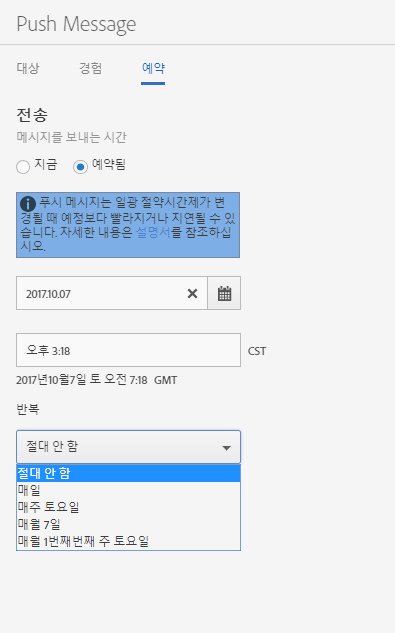

# 일정: 푸시 메시지{#schedule-push-message}

Adobe Mobile Services UI에서는 푸시 메시지가 즉시 전달되도록 예약하고 나중에 배달되도록 하며 반복되는 이벤트로 예약할 수 있습니다. 이러한 이벤트는 일별, 주별 또는 월별 기준으로 예약할 수 있습니다.

>[!TIP]
>
>사용자는 언제든지 푸시 메시지 작업에 대한 예약 설정을 수정할 수 있습니다. 반복적인 예약 메시지를 보내는 데 적용 가능한 날짜가 없는 경우(예: 31일마다 매월 반복 작업이 2월 31일 또는 그 달의 5일 화요일) 메시지가 전송되지 않습니다.

다음 정보를 숙지하십시오.

* 올바른 날짜 및 시간 형식은 `hh:mm` 및`mm/dd/yyyy`입니다.

* 예약된 메시지는 다음 방법으로 편집할 수 있습니다.

   * 날짜를 이후의 날짜로 변경합니다.
   * 반복 간격을 다른 간격으로 변경합니다.

      예를 들어 원래 매일 전송된 메시지가 있는 경우 반복을 주주로 전환할 수 있습니다.

## 반복 푸시 메시지를 예약하기 전에

반복 푸시 메시지를 예약하기 전에 다음 정보를 이해&#x200B;**해야** 합니다.

* **[!UICONTROL 반복]** 드롭다운 목록에 표시되는 옵션은 입력하거나 선택한 날짜에 따라 다릅니다.

   예를 들어 `Saturday, October 7`을 입력한 경우 다음 옵션이 표시됩니다.

   * **[!UICONTROL 절대 안 함]**
   * **[!UICONTROL 매일]**
   * **[!UICONTROL 매주 토요일]**
   * **[!UICONTROL 매월 7일]**
   * **[!UICONTROL 매월 첫 번째 주 토요일]**

* 푸시 메시지는 그리니치 평균 시간(GMT)을 기준으로 예약되고 전송됩니다.

   예를 들어, 10월 7일부터 매주 토요일 오후 12시( **태평양**&#x200B;표준시)에 반복 메시지가 전송되도록 예약한 경우, 실제 메시지는 토요일 오후 7시 **GMT에 전송됩니다**.
* 메시지가 미국, 유럽 또는 아시아 지역에 따라 다르게 전송됩니다.

   예를 들어, 캘리포니아 주 산호세에 있고, 10 ***월 31일*** 오후 5시 30분 **PST**&#x200B;에 ***보내질 메시지*** 를 예약하는 경우, 메시지는 실제로 11 **월 1**&#x200B;일 오전 12시 30분GMT에 전송됩니다. 귀하가 도쿄에 거주하고 있는 상태에서 ***1월 1*** 일 오전 5시 30분에 ***발송되는 메시지를 예약하는 경우, 12*** 월 31일 오후 8시 30분 **GMT**&#x200B;로 발송됩니다.
* 푸시 메시지는 낮에 약해지는 시간에 따라 한 시간 이전 또는 그 후에 전송됩니다.
* 푸시 메시지 보고서를 보면 메시지가 시스템의 로컬 시간대에 표시됩니다.

   예를 들어 시작 시간이 오후 12시( **PST**)인 경우 메시지가 오후 7시( **GMT**)에 전송되지만 메시지 보고서에 오후 12시 00분 **PST로**&#x200B;전송되는 시간이 표시됩니다.

## 반복 푸시 메시지 예약 {#section_675BD754E5A04423A1751193698A978F}

1. 새 푸시 메시지에 대한 예약 페이지에서 **[!UICONTROL 예약됨]** 또는 **[!UICONTROL 지금]**&#x200B;을 선택합니다.

   자세한 내용은 [푸시 메시지 만들기](/help/using/in-app-messaging/t-create-push-message/t-create-push-message.md)를 참조하십시오.

   **[!UICONTROL 지금]**&#x200B;을 선택하면 메시지가 즉시 푸시됩니다. 메시지가 즉시 예약되지 않도록 하려면 **[!UICONTROL 초안으로 저장을 클릭합니다]**.

   

1. **[!UICONTROL 예약됨]**&#x200B;을 선택한 경우 달력 아이콘을 클릭하고 시작 날짜를 선택하거나 입력합니다.
1. 시간을 입력합니다. 
1. **[!UICONTROL 반복]**&#x200B;에서 다음 옵션 중 하나를 선택합니다.

   * **[!UICONTROL 절대 안 함]**
   * **[!UICONTROL 매일]**
   * **[!UICONTROL 매주 화요일]**
   * **`<Day x>`해당 월의**

      표시된 옵션은 시작일로 선택하거나 입력한 날에 따라 변경됩니다.
   * **`<nth day>`매월**

      표시된 값은 시작 날짜로 선택하거나 입력한 날짜에 따라 변경됩니다.

1. **[!UICONTROL 반복 종료]**&#x200B;에 종료 날짜 및 시간을 입력합니다.
1. 다음 옵션 중 하나를 클릭합니다.

   * **[!UICONTROL 초안으로 저장]**

      이 옵션은 메시지를 초안 형식으로 저장합니다. 완료되지 않은 메시지를 저장하거나, 활성화 전에 다른 사람이 해당 메시지를 편집하고 승인할 수 있게 하려면 이 옵션을 선택할 수 있습니다.

      이전 단계에서 **[!UICONTROL 지금]**&#x200B;을 선택한 경우 활성화 시 초안 메시지가 즉시 전송됩니다. 메시지를 푸시할 날짜와 시간을 선택한 경우 메시지가 이 예약에 따라 푸시됩니다.

   * **[!UICONTROL 저장 및 예약]**

      이 옵션은 예약된 날짜와 시간에 메시지를 전송합니다.

나중에 초안 메시지를 푸시하려면 다음 작업 중 하나를 완료하십시오.

* **[!UICONTROL 메시지 관리]**&#x200B;를 클릭하고, 메시지 옆에 있는 확인란을 선택한 다음 **[!UICONTROL 선택한 항목 활성화]**&#x200B;를 클릭합니다.
* 메시지를 저장 및 발송하려면 **[!UICONTROL 저장 및 보내기]**&#x200B;를 클릭하십시오.
