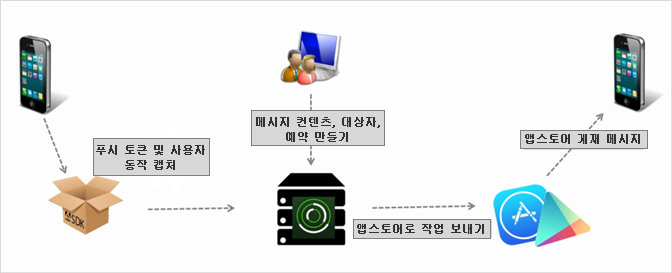

# 푸시 메시지 작성 {#create-a-push-message}

사용자를 참여시킬 때 강력한 Analytics 데이터를 이용하기 위해 푸시 메시지를 Mobile Services UI에서 Analytics 세그먼트로 보낼 수 있습니다.

>[!IMPORTANT]
>
>푸시 메시지를 만들기 전에 [푸시 메시지를 활성화하기 위한 전제 조건](/help/using/c-manage-app-settings/c-mob-confg-app/configure-push-messaging/prerequisites-push-messaging.md)을 참조하십시오.

푸시 메시지는 앱을 사용하고 있지 않을 때 알림을 수신하도록 선택한 사용자에게 표시됩니다. 이러한 알림은 사용자에게 새 업데이트, 오퍼 및 다시 알림에 대해 알려줍니다. 이러한 알림을 사용하면 간소화된 워크플로우로 푸시 메시지를 만들고, 테스트하고, 관리하고, 이에 대해 보고할 수 있습니다.

푸시 메시지는 Adobe Mobile Services가 아니라 앱 스토어에 의해 서버 측에서 전송됩니다.

푸시 메시지 작성 방법:

1. ***your_app_name*** > **[!UICONTROL 메시징]** > **[!UICONTROL 메시지 관리]** > **[!UICONTROL 메시지 작성]** > **[!UICONTROL 푸시 만들기]**&#x200B;를 클릭합니다.
1. 대상 옵션을 구성합니다.

   자세한 내용은 [대상: 푸시 메시지에 대한 대상 세그먼트 정의 및 구성](/help/using/in-app-messaging/t-create-push-message/c-audience-push-message.md)을 참조하십시오.
