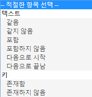

# Audience: in-app message {#audience-in-app-message}

보기, 트리거 및 트레이트 옵션을 비롯한 인앱 메시지의 대상 옵션을 구성할 수 있습니다.

1. In your app, click **[!UICONTROL Messaging]** &gt; **[!UICONTROL Manage Messages]** &gt; **[!UICONTROL Create Message]** &gt; **[!UICONTROL Create In-App]**.
1. 대상 페이지에서 다음 필드에 정보를 입력하십시오.

   * **[!UICONTROL 보기]**

      표시할 메시지를 트리거하는 옵션을 선택합니다.

      * **[!UICONTROL 항상]**

         이 옵션은 트리거가 발생할 때마다 메시지가 표시됨을 의미합니다.

      * **[!UICONTROL 한 번]**

         이 옵션은 트리거가 처음 발생할 때만 메시지가 표시됨을 의미합니다.

      * **[!UICONTROL 클릭스루할 때까지]**

         이 옵션은 사용자가 클릭스루할 때까지 트리거가 발생할 때마다 메시지가 표시됨을 의미합니다. 이 트리거는 전체 화면 및 경고 메시지에만 적용됩니다. 대부분의 메시지는 인터넷에서 리소스를 리디렉션하거나 사용해야 하며, 오프라인 상태인 경우 표시되지 않습니다. 네트워크 연결과 관계없이 항상 메시지를 표시하려면 **[!UICONTROL 오프라인으로 표시]확인란을 선택하십시오.**
   * **[!UICONTROL 트리거]**

      드롭다운 목록에서 옵션을 선택하고 조건을 선택합니다. 예를 들어, 첫 번째 드롭다운 목록에서 **[!UICONTROL 시작됨]**&#x200B;을 선택하고, 두 번째 드롭다운 목록에서 **존재함]을 선택할 수 있습니다.[!UICONTROL ** 메시지를 표시하기 위해 트리거에 있어야 하는 사용자 지정 컨텍스트 데이터를 지정할 수도 있습니다.

      >[!IMPORTANT]
      >
      >여러 트리거를 선택하면 표시할 메시지가 동일한 히트에서 모두 발생해야 합니다.

   * **[!UICONTROL 트레이트가]**
트리거될 때 인앱 메시지를 보게 될 사람을 결정하고 데이터를 지정된 데이터로 필터링한 히트 (세그먼트) 를 필터링할 수 있습니다. 예를 들어, 관심 영역에 Denver가 들어 있는 규칙을 정의할 수 있습니다. 이 필터를 사용하면 트리거 시 이름에 Denver가 있는 관심 영역 중 하나에 있는 고객에게 메시지를 표시할 수 있습니다.

## Additional information about traits and triggers {#section_48C39EFB8CAA4F62B994FCC91DF588E6}

>[!IMPORTANT]
>
>트리거와 트레이트는 앱에서 Analytics에 전달되는 데이터를 사용합니다. 이러한 값은 컨텍스트 데이터, 매핑된 변수 및 지표로 전달됩니다. 변수는 텍스트 기반 값이며 지표는 숫자 값입니다.

To see the mapping of these key value pairs in the Mobile Services UI and validate the value for your trigger, click **[!UICONTROL Manage App Settings]** &gt;  **[!UICONTROL Manage Variables &amp; Metrics]** &gt;, which displays the following tabs:

* **[!UICONTROL 표준 변수 및 지표]**
* **[!UICONTROL 사용자 지정 변수]**
* **[!UICONTROL 사용자 지정 지표]**

매핑의 유효성을 검사한 후 적절한 항목 또는 논리 연산자를 선택하여 메시지에 대한 대상을 구성하십시오.

### Selecting metrics and variables {#example_AB126F03BD1C4094B791E230B3DB1189}

다음 시나리오는 트리거로 지표 또는 변수를 선택할지 여부를 결정하는 데 도움이 됩니다.

### 지표

지표는 숫자이며 예로는 구입 횟수가 있습니다.

1. Click **[!UICONTROL Manage Messages]** &gt; **[!UICONTROL Create Message]**.
1. **[!UICONTROL 대상]탭의****트리거[!UICONTROL 섹션에서 다음 단계를 완료합니다.]**

   1. **[!UICONTROL 시작과]** 같은 표준 이벤트를 선택하고 **[!UICONTROL [존재함]**] 를 선택합니다.
   1. 사용자 지정 데이터 포인트이며 지표에 매핑된 두 번째 트리거를 선택합니다.
   1. **[!UICONTROL [번호]**] 아래에서 [매트] 옵션을 선택합니다.

### 변수

변수는 고유 식별자인 텍스트 문자열이며 예로는 국가, 공항 등이 있습니다.

1. Click **[!UICONTROL Manage Messages]** &gt; **[!UICONTROL Create Message]**.
1. **[!UICONTROL 대상]탭의****트리거[!UICONTROL 섹션에서 다음 단계를 완료합니다.]**

   1. **[!UICONTROL 시작과]** 같은 표준 이벤트를 선택하고 **[!UICONTROL [존재함]**] 를 선택합니다.
   1. 사용자 지정 데이터 포인트이며 변수에 매핑된 두 번째 트리거를 선택합니다.
   1. **[!UICONTROL 텍스트]**&#x200B;아래에서 [매트] 옵션을 선택합니다.

For more information about context data, variables, and metrics, see [Managing your app](/help/using/manage-apps/manage-apps.md).
