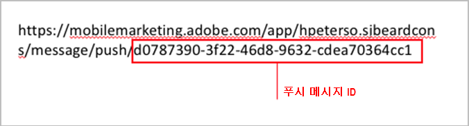
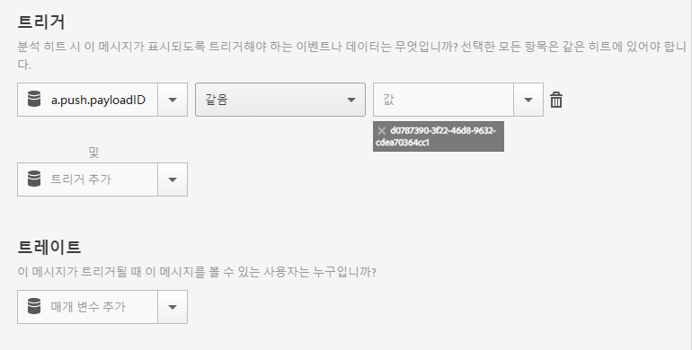

# 푸시 메시지에서 앱이 열릴 때 인앱 메시지 트리거하기{#trigger-an-in-app-message-when-the-app-is-opened-from-a-push-message}

{#eol}

사용자가 푸시 메시지에서 앱을 열었을 때 인앱 메시지 트리거를 푸시 메시지 ID로 설정할 수 있습니다.

1. 사용자에게 전송될 푸시 메시지에 대한 푸시 메시지 ID를 가져옵니다.

   메시지 작성 워크플로우 중에 URL에서 푸시 메시지 ID를 찾을 수 있습니다.

   다음은 한 예입니다.

   

1. 다음 트리거로 인앱 메시지를 저장 및 활성화:

   `"a.push.payloadID" =`

   >[!TIP]
   >
   >푸시 메시지 ID는 1단계에서 지정한 ID입니다.

   이 트리거는 **[!UICONTROL 트리거]** 드롭다운 목록에서 사용할 수 없으므로 수동으로 추가해야 합니다.

   

1. 저장 후 1단계의 푸시 ID가 포함된 푸시 메시지를 보냅니다.
1. 푸시 메시지를 클릭하여 앱을 열고, 앱이 열릴 때 인앱 메시지가 표시되는지 확인합니다.

   테스트하는 동안 다음 정보를 기억하십시오.

   * 인앱 메시지를 저장한 후 호스팅된 구성 파일이 새 메시지로 업데이트되는 데 약 45초가 소요됩니다.
   * 이 있는 경우 앱은 구성 파일 업데이트(새로운 인앱 메시지)를 찾습니다. **신규** launch를 사용하려면 푸시 메시지를 클릭할 때 앱이 새 실행을 실행하는지 확인해야 합니다.
   이는 일반적으로 세션 시간 초과가 발생했는지 확인해야 함을 의미합니다. 기본 시간 제한은 5분입니다.
