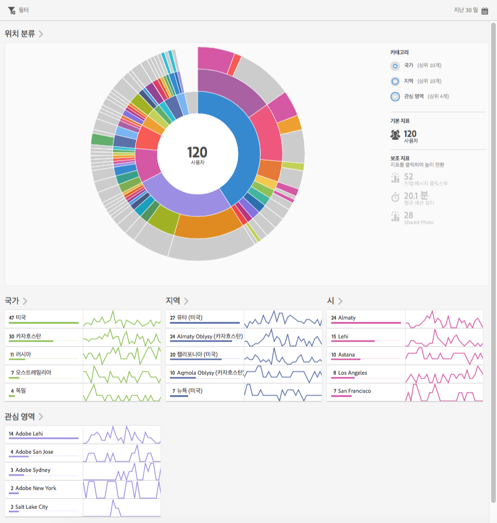
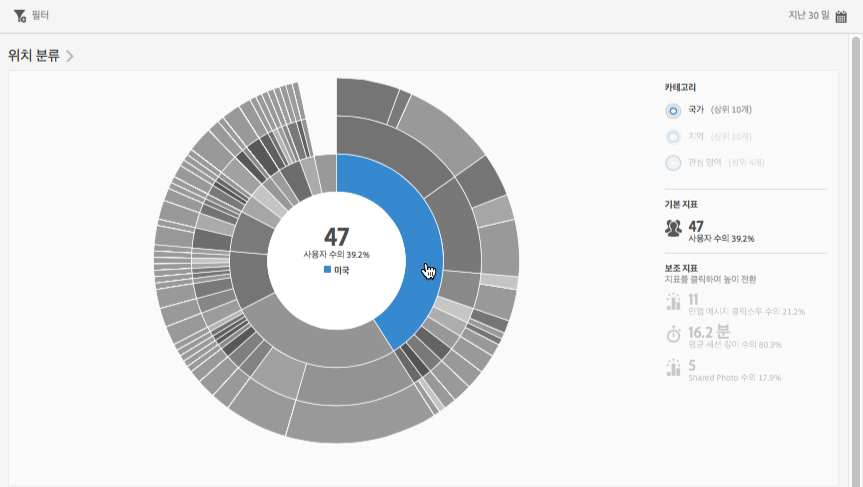
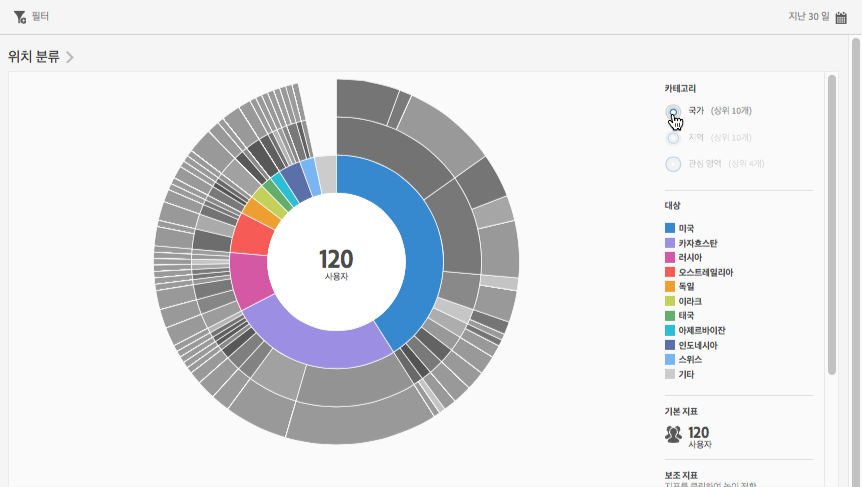
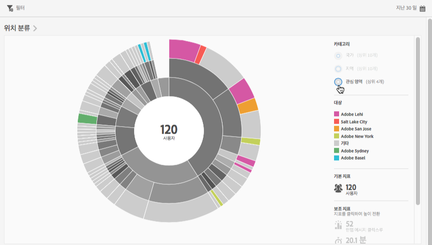
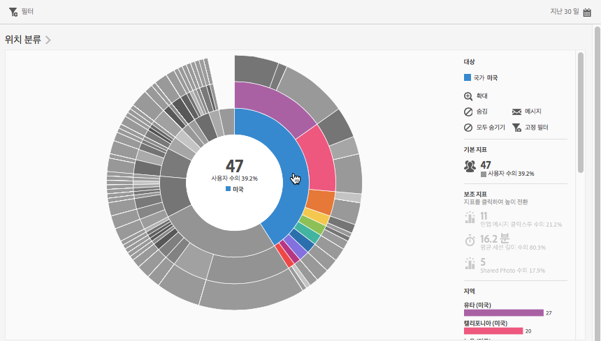
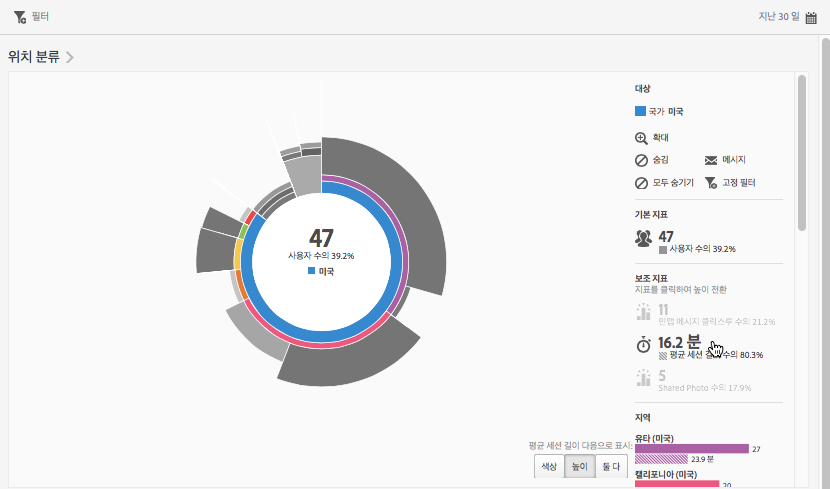
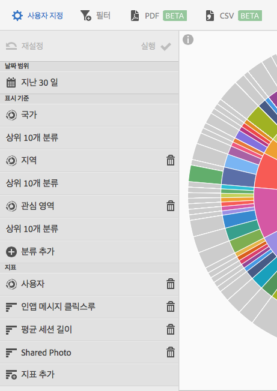

# 개요(위치){#overview-location}

**[!UICONTROL 위치 개요]** 보고서에서는 앱이 사용되는 다양한 국가, 지역 및 POI(관심 영역)를 볼 수 있습니다.

이 보고서는 기존 데이터에 대한 Sunburst 시각화 시각화를 제공하므로, 이 보고서를 사용하여 타깃팅할 대상 세그먼트(방문자 컬렉션)를 검색할 수 있습니다. 대상을 만들고 관리하는 일은 현재 Experience Cloud에서 대상을 이용할 수 있다는 점을 제외하고, 세그먼트를 만들고 사용하는 일과 비슷합니다.

다음은 이러한 보고서에 대한 추가 정보입니다.

## 탐색 및 사용 {#section_4A88C3849B5847BF8CF433CCFD99FDC3}

이 시각화는 분류가 포함된 기본 보고서 등을 제공합니다. 시각화는 높이를 사용하여 주목할 지표를 표시하고 지표 간의 성능 차이를 표시합니다. 개별 고리는 고리 카테고리의 대상 세그먼트를 나타냅니다. 고정 필터 적용, 지표 숨기기, 지표 보기 등 대상에 대한 작업을 수행할 수 있습니다.

>[!TIP]
>
>이 정보 이외에 Sunburst 차트와 상호 작용하는 방법을 설명하는 제품 내 자습서를 볼 수 있습니다. 자습서를 시작하려면 보고서의 제목 표시줄에서 **[!UICONTROL 위치 분류]**&#x200B;를 클릭한 다음 **[!UICONTROL i]** 아이콘을 클릭합니다.

이 선버스트 차트는 대화형입니다. 오른쪽 상단에 있는 **[!UICONTROL 달력]** 아이콘을 클릭하여 기간을 변경할 수 있습니다. 자세한 정보를 표시하려면 마우스를 차트 위에 놓으십시오. 예를 들어, 다음 그림에서는 미국에서 사용자의 앱을 사용하는 사용자의 총 수와 비율을 확인할 수 있습니다.

이 그림에서는 오른쪽 상단 모서리의 **[!UICONTROL 카테고리]** 단추를 사용하여 상위 10개 국가, 지역 및 상위 3개 **[!UICONTROL 관심 영역]**&#x200B;에 대한 정보 보기 간에 전환할 수 있습니다.

다음은 **[!UICONTROL 국가]**&#x200B;를 선택하는 경우의 시각화입니다.

다음은 **[!UICONTROL 관심 영역]**&#x200B;을 선택하는 경우의 시각화입니다.

고리의 구획을 클릭하면 확대하기, 대상 숨기기, 인앱 메시지 또는 고정 필터 생성하기 등의 작업을 수행할 수 있는 대상을 선택할 수 있습니다.

오른쪽의 보조 지표를 클릭하여 시각화에 추가하고, 색, 높이 또는 둘 다 사용하여 이 지표를 표시할 수 있습니다.

## 분류 및 지표 추가 {#section_15833511E82648869E7B1EFC24EF7B82}

차트에서 다른 대상과 관련하여 각 대상의 높이를 변경하는 분류 및 보조 지표를 추가할 수 있습니다.

>[!TIP]
>
>Sunburst에 고리를 많이 추가할수록 처리 시간이 오래 걸립니다.

분류 및 보조 지표를 추가하려면, 보고서의 제목 표시줄에서 **[!UICONTROL 위치 분류]**&#x200B;를 클릭한 다음, **[!UICONTROL 사용자 지정]**&#x200B;을 클릭하여 오른쪽의 레일을 엽니다.

**[!UICONTROL 분류 추가]** 또는 **[!UICONTROL 지표 추가]**&#x200B;를 클릭하면, 새 항목이 각 목록에 있는 이전 항목과 동일한 이름으로 표시됩니다. 새 항목을 선택할 수 있는 드롭다운 목록에 액세스하려면 새로 만든 분류나 지표를 클릭하십시오.

## 고정 필터 만들기 {#section_365999D49FC744ECBF9273132497E06C}

고리에서 구획을 클릭하여 고정 필터를 만들 대상을 선택한 다음, **[!UICONTROL 고정 필터를 클릭합니다]**. 고정 필터를 사용하면 현재 필터를 적용하고 필터를 기반으로 새 보고서를 실행할 수 있습니다.

## 보고서 공유 {#section_F8AF2AA73D4C4C008976D45847F82D0B}

보고서를 만든 후 설정으로 사용자 지정 URL을 만들어 복사 및 공유할 수 있습니다.

## 추가 정보

위치에 대한 자세한 내용은 다음 컨텐츠를 참조하십시오.

* [맵](/help/using/location/c-map-points.md)
* [관심 영역 관리](/help/using/location/t-manage-points.md)
