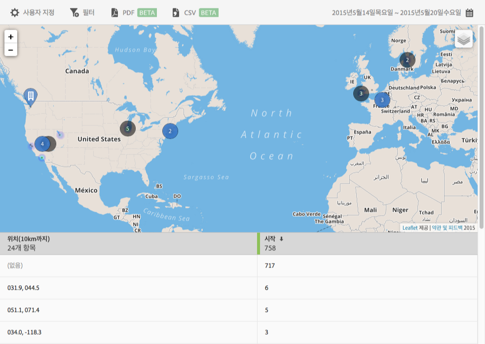

# 맵 {#map}

POI 및 기타 데이터 마커를 표시하는 대화형 맵을 볼 수 있습니다.

다음은 기억해야 할 몇 가지 중요한 정보입니다.

* You can increase or decrease the size of the map.

   이 기능은 예를 들어 서로 밀접한 두 개의 관심 영역이 있는 경우 유용합니다. 맵을 확대하면 더 자세히 볼 수 있습니다.
* 해당 관심 영역이 파란색으로 표시됩니다.

   시작과 같은 기타 데이터 마커는 검은색으로 표시됩니다. 자세한 내용을 보려면 마커를 클릭하십시오.

Click  to select the following options:

* **[!UICONTROL 맵]**

   단순 맵을 표시합니다.

* **[!UICONTROL Satellite]**
Display the map in satellite mode.

* **[!UICONTROL 데이터 마커]**

   검정색 데이터 마커를 표시할지 여부를 선택합니다.

* **[!UICONTROL 열 색상 분석]**

   열 색상 분석 마커를 표시할지 여부를 선택합니다. 색상이 진할수록 조건(예: 시작)이 더 자주 충족됩니다.

* **[!UICONTROL 관심 영역]**

   관심 영역을 표시할지 여부를 선택합니다.

이 보고서에 대해 다음 옵션을 구성할 수 있습니다.

* **[!UICONTROL 기간]**

   **[!UICONTROL 달력]아이콘을 클릭하여 사용자 지정 기간을 선택하거나 드롭다운 목록에서 사전 설정된 기간을 선택합니다.**

* **[!UICONTROL 사용자 지정]**

   Customize your reports by changing the **[!UICONTROL Show By]** options, adding metrics and filters, and adding additional series (metrics), and more. For more information, see [Customize reports](/help/using/usage/reports-customize/t-reports-customize.md).

* **[!UICONTROL 필터]**

   **[!UICONTROL 필터]를 클릭하면 다른 보고서에 적용되는 필터를 생성하여 세그먼트가 모든 모바일 보고서에서 어떻게 작동하는지 확인할 수 있습니다.** 고정 필터를 사용하면 경로 지정 외의 모든 보고서에 적용되는 필터를 정의할 수 있습니다. For more information, see [Add a sticky filter](/help/using/usage/reports-customize/t-sticky-filter.md).

* **[!UICONTROL 다운로드]**

   Click **[!UICONTROL PDF]** or **[!UICONTROL CSV]** to download or open documents and share with users who do not have access to Mobile Services or to use the file in presentations.