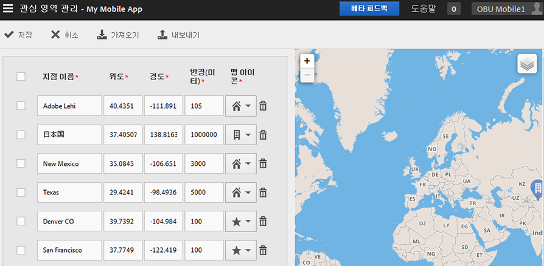

# 관심 영역 관리 {#manage-points-of-interest}

상관 관계 목적으로 사용하고, 인앱 메시지로 타깃팅하는 등의 작업을 수행할 수 있는 지리적 위치를 정의할 수 있는 POI를 만들고 관리할 수 있습니다. POI에서 히트가 전송되면 POI가 히트에 연결됩니다.

위치를 사용하기 전에 다음 요구 사항을 확인하십시오.

* Analytics—Mobile Apps 또는 Analytics Premium이 있어야 합니다.
* 앱에 대해 **[!UICONTROL 위치 보고서]**&#x200B;를 활성화해야 합니다.
* iOS SDK 또는 Android SDK 4.2 이전 버전을 사용 중인 경우, 새 **[!UICONTROL 관심 영역]**&#x200B;을 추가한 후 새 구성 파일을 다운로드하여 앱 개발자에게 제공해야 합니다.

   iOS SDK나 Android SDK 버전 4.2 이상을 사용 중인 경우, 앱 업데이트를 스토어에 제출하여 **[!UICONTROL 관심 영역]**&#x200B;을 업데이트할 필요가 없습니다. 관심 영역 관리 페이지에서 **[!UICONTROL 저장]**&#x200B;을 클릭하면 변경 내용이 **[!UICONTROL 관심 영역]** 목록에 패키지화되고 라이브 앱에 대한 구성 파일이 업데이트됩니다. 앱이 원격 POI URL이 있는 구성과 업데이트된 SDK를 사용하는 한, 저장을 해도 사용자 장치에서 앱의 관심 영역 목록이 업데이트됩니다.

사용자의 장치에서 히트가 **[!UICONTROL 관심 영역]**&#x200B;에 지정되도록 하려면, 해당 앱에 대해 위치가 활성화되어 있어야 합니다.

위치를 사용하려면 다음 작업을 완료하십시오.

1. 앱 이름을 클릭하여 해당 앱 설정 관리 페이지로 이동합니다.
1. **[!UICONTROL 위치]** > **[!UICONTROL 관심 영역 관리]**&#x200B;를 클릭합니다.

   

1. 다음 각 필드에 정보를 입력합니다.

   * **[!UICONTROL 지점 이름]**

      **[!UICONTROL 지점]** 이름을 입력합니다.

      이 이름은 도시, 국가 또는 지역일 수 있습니다. 경기장이나 사업체와 같은 특정 위치 주변에 **[!UICONTROL 지점]**&#x200B;을 만들 수도 있습니다.

   * **[!UICONTROL 위도]**

      **[!UICONTROL 지점의 위도를 입력합니다]**. 이 정보는 인터넷을 포함한 다른 소스에서 찾을 수 있습니다.

   * **[!UICONTROL 경도]**

      **[!UICONTROL 지점의 경도를 입력합니다]**. 이 정보는 인터넷을 포함한 다른 소스에서 찾을 수 있습니다.

   * **[!UICONTROL 반경(미터)]**

      포함할 **[!UICONTROL 지점]** 주변 반경(미터 단위)을 입력합니다. 예를 들어 콜로라도주의 덴버에 대해 POI를 만드는 경우, 덴버 시와 주변 지역을 포함하되, 콜로라도 스프링스는 제외하도록 반경 크기를 충분하게 지정할 수 있습니다.

   * **[!UICONTROL 맵 아이콘]**

      [개요](/help/using/location/c-location-overview.md) 및 [맵](/help/using/location/c-map-points.md) 보고서에 표시할 아이콘을 선택합니다.

1. 필요에 따라 더 많은 POI를 추가합니다.

   5,000개 이하의 POI를 추가하는 것이 좋습니다. 5,000개 이상을 추가하는 경우, 지점을 저장할 수는 있지만, 우수 사례에 5,000개 이하의 영역을 추가하라고 언급되어 있다는 경고 메시지가 표시됩니다.

1. **[!UICONTROL 저장]**&#x200B;을 클릭합니다.

POI를 한 개 이상 삭제하려면, 원하는 확인란을 선택한 다음 **[!UICONTROL 선택한 항목 제거]**&#x200B;를 클릭합니다.

Adobe Mobile 사용자 인터페이스를 사용하지 않고 **[!UICONTROL 파일을 사용하여 데이터 작업을 수행하려면]**&#x200B;가져오기&#x200B;**[!UICONTROL 또는]**&#x200B;내보내기`.csv`를 클릭합니다.
