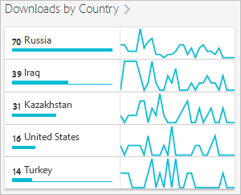

# 앱스토어 개요 보고서{#app-store-overview-report}

**[!UICONTROL 앱스토어 개요]** 보고서는 다운로드 수, 인앱 구매, 앱스토어 평균 등급, 다운로드 매출, 인앱 매출, 국가별 다운로드 수, 앱스토어별 다운로드 수, 이름별 인앱 구매를 포함한 앱스토어 측정 지표 스냅숏을 제공합니다.

>[!TIP]
>
>통합을 구성하고 나면 Mobile Services UI에서 **[!UICONTROL 앱스토어]** 메뉴 항목 및 **[!UICONTROL 개요]** 보고서가 왼쪽 탐색 메뉴에 표시됩니다.

**[!UICONTROL 개요]** 보고서에는 앱스토어 다운로드 수, 앱을 사용한 인앱 구매 및 앱 평균 등급 정보를 표시하는 시간 그래프가 포함되어 있습니다.

지표를 클릭하여 해당 라인을 숨기거나 표시할 수 있습니다. 하루에 대한 데이터를 보려면 해당 날짜를 마우스로 가리킵니다.

>[!IMPORTANT]
>
>Adobe Analytics에서 다운로드, 순위, 수익, 평점 등과 같은 앱스토어 지표를 사용하려면 Data Connector와 적절한 공급업체의 통합이 필요합니다. `appFigures`는 통합을 활성화하기 전에`appFigures` ****&#x200B;에서 적절한 제품이나/또는 서비스 구매를 필요로 하는 통합을 현재 제공합니다. Data Connector에 대한 더 자세한 내용은 [Adobe Exchange](https://www.adobeexchange.com/experiencecloud.html)를 확인하세요.

>[!TIP]
>
>오른쪽 상단에 있는 달력 아이콘을 클릭하여 보고서의 날짜 범위를 변경하는 기능 외에도, 드릴다운 보고서의 일부를 사용자 지정하고, 필터 및 시리즈(지표)를 추가하고, 고정 필터를 추가하고, PDF 또는 CSV 형식으로 보고서를 다운로드할 수 있습니다. 자세한 내용은 [보고서 사용자 지정](/help/using/usage/reports-customize/reports-customize.md)을 참조하십시오.

## 앱스토어 평균 등급 {#section_60D0D21824AE4450BC3E34D7ACA12A7A}

이 보고서는 사용자가 앱스토어 기능을 사용하여 앱에 대해 매긴 평균 등급을 표시합니다.

**[!UICONTROL 앱스토어 평균 등급]** 위젯의 아무 곳이나 클릭하여 평균 등급을 날짜별로 나타내는 그래프와 차트를 표시할 수 있습니다. 하루에 대한 데이터를 보려면 해당 날짜를 마우스로 가리킵니다.

## 다운로드 매출 {#section_34F05998E8444544A1B507C1B852C4EE}

이 보고서는 앱을 다운로드하여 생성된 매출액을 표시합니다.

## 인앱 매출 {#section_58792ED9C4B54B7D836E30CF09E8E204}

이 보고서는 앱을 사용한 인앱 구매의 매출액을 표시합니다.

## 국가별 다운로드 수 {#section_10373CD28CA94BA5859DFDEED7D548C6}

이 보고서는 국가별로 그룹화된 앱의 다운로드 수를 표시합니다.

국가별 다운로드 횟수를 표시하는 그래프 및 차트를 날짜별로 표시하려면 국가별 다운로드 수&#x200B;**[!UICONTROL 를 클릭합니다]**. 날짜 위로 마우스를 가져가면 하루 동안의 데이터를 볼 수 있습니다.

## 앱스토어별 다운로드 {#section_F1CD1A3F0105469D879E4F280CE32484}

이 보고서는 앱스토어별로 그룹화된 앱의 다운로드 수를 표시합니다.

날짜별로 그룹화된 앱스토어별 다운로드 수를 표시하는 그래프와 차트를 표시하려면 앱스토어별 다운로드 수&#x200B;**[!UICONTROL 를 클릭합니다]**. 날짜 위로 마우스를 가져가면 해당 날짜의 데이터를 볼 수 있습니다.

## 이름별 인앱 구매 {#section_D747A64F9F6449E0A02EF31D56C92F83}

이 보고서는 이름별로 모든 인앱 구매를 표시합니다.
