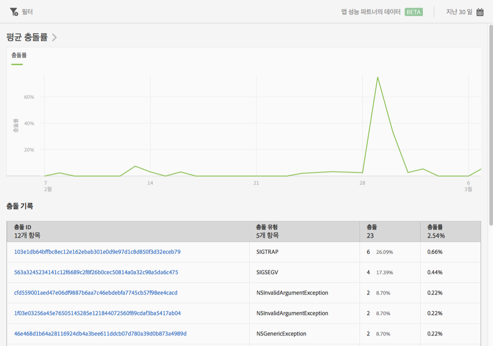

# 충돌 보고서 {#crashes}

**[!UICONTROL 충돌]보고서는 앱 충돌에 대한 스냅숏을 제공합니다.** 충돌 수 및 충돌률이 표시되며, Apteligent 사용자 인터페이스에 로그인할 수 있습니다.

>[!IMPORTANT]
>
>To display the **[!UICONTROL Crashes]** report in the left navigation, you must first integrate your app with Apteligent.

**[!UICONTROL 평균 충돌률]** 그래프는 날짜별로 충돌률을 표시합니다. 충돌률을 보려는 날짜 위로 마우스를 가져가면 해당 날짜의 데이터를 볼 수 있습니다.

**[!UICONTROL 충돌 내역]** 차트는 충돌 ID, 충돌 유형, 번호 또는 충돌, 충돌 날짜 등 각 앱 충돌에 대한 정보를 표시합니다. Apteligent에 로그인하여 충돌에 대한 자세한 내용을 보려면 **[!UICONTROL 충돌 ID]열의 링크를 클릭하십시오.**

이 보고서에 대해 다음 옵션을 구성할 수 있습니다.

* **[!UICONTROL 기간]**

   **[!UICONTROL 달력]아이콘을 클릭하여 사용자 지정 기간을 선택하거나 드롭다운 목록에서 사전 설정된 기간을 선택합니다.**

* **[!UICONTROL 필터]**

   **[!UICONTROL 필터]를 클릭하면 다른 보고서에 적용되는 필터를 생성하여 세그먼트가 모든 모바일 보고서에서 어떻게 작동하는지 확인할 수 있습니다.** 고정 필터를 사용하면 경로 지정 외의 모든 보고서에 적용되는 필터를 정의할 수 있습니다.

   자세한 내용은 [고정 필터를 추가합니다](/help/using/usage/reports-customize/t-sticky-filter.md).