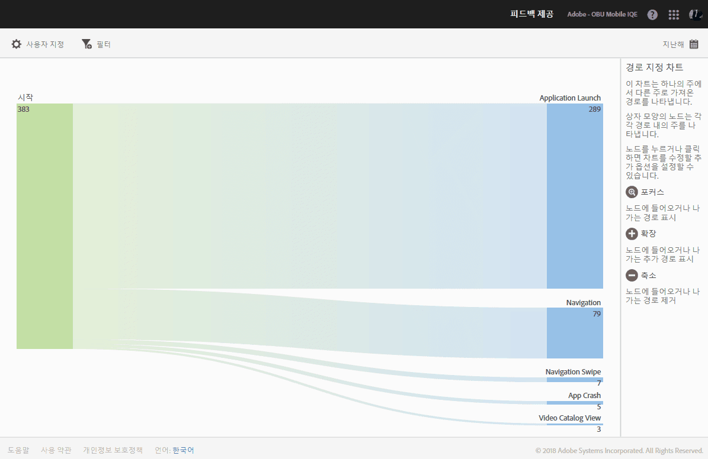
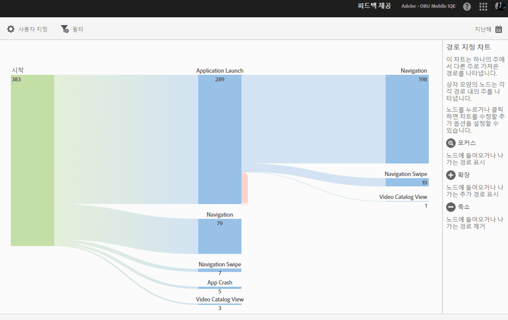
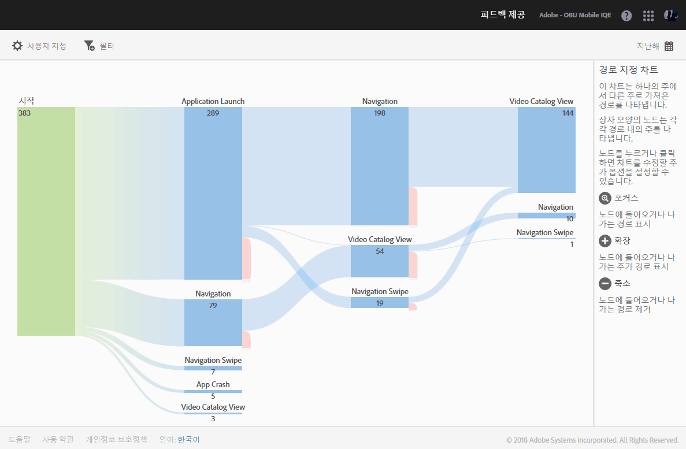

# 작업 경로 보고서{#action-paths}

작업 경로 보고서는 경로 분석을 기반으로 하며, 앱의 한 상태에서 다른 상태로 이동되는 경로를 나타내는 경로 지정 차트를 표시합니다.

**[!UICONTROL 경로 보기]** 및 **작업 경로[!UICONTROL 보고서는 모두 경로 지정 보고서입니다.]** **[!UICONTROL 경로 보기]보고서는 사용자가 앱의 한 화면에서 다음 화면으로 이동하는 방식을 보여줍니다.** **[!UICONTROL 작업 보기]보고서는 사용자가 앱에서 수행하는 클릭, 선택, 크기 조정 등과 같은 작업 및 이벤트 순서를 표시합니다.**

>[!TIP]
>
>단계 보고서를 사용하여 한 보고서에서 탐색과 작업을 결합할 수 있습니다. For more information, see [Funnel](/help/using/usage/reports-funnel.md).

상자 모양의 각 노드는 앱에서 사용자 경로에 있는 상태를 나타냅니다. 예를 들어, 위의 그림에서 맨 위의 노드는 앱을 시작한 다음 갤러리에서 사진을 선택한 사용자의 수를 나타냅니다.

To display the options to modify the chart, click a node and click **[!UICONTROL Focus]** or **[!UICONTROL Expand]**. 예를 들어, 맨 위 노드에서 **[!UICONTROL 사진 선택됨]** 상태를 클릭하면 **[!UICONTROL 포커스]및**&#x200B;확장] 아이콘이 표시됩니다.**[!UICONTROL **

To expand, click the **[!UICONTROL +]** icon. 이 옵션을 사용하면 노드에 포함되거나 노드를 벗어나는 추가 경로가 표시됩니다. 아래 그림에서 상태 1은 앱을 실행하고, 상태 2는 사진(이전에 확장한 항목)을 선택하고, 상태 3은 사용자가 선택한 다른 경로가 포함되어 있음을 나타냅니다.

* 항목 선택
* 항목 추가
* 항목 드래그
* 항목 크기 조절

상태를 확장하는 것은 단계와 유사합니다.

To isolate the node and show paths that come into, and go out of the selected node, click the   icon. 아래 그림에서 사용자가 사진을 선택하기 **전에** 다음 경로가 완료되었습니다.

* 항목 회전
* 항목 크기 조절
* 항목 드래그
* 항목 제거

사진을 선택한 사용자 중에서 사진이 선택된 **후** 다음 경로가 완료되었습니다.

* 항목 선택
* 항목 추가
* 항목 드래그
* 항목 크기 조절

여러 노드에 초점을 맞추거나 확장하여 앱에서 사용자가 선택하는 경로를 자세히 볼 수 있습니다. 예:

이 보고서에 대해 다음 옵션을 구성할 수 있습니다.

* **[!UICONTROL 기간]**

   **[!UICONTROL 달력]아이콘을 클릭하여 사용자 지정 기간을 선택하거나 드롭다운 목록에서 사전 설정된 기간을 선택합니다.**

* **[!UICONTROL 사용자 지정]**

   Customize your reports by changing the **[!UICONTROL Show By]** options, adding metrics and filters, and adding additional series (metrics), and more. For more information, see [Customize reports](/help/using/usage/reports-customize/reports-customize.md).

* **[!UICONTROL 필터]**

   **[!UICONTROL 필터]를 클릭하면 다른 보고서에 적용되는 필터를 생성하여 세그먼트가 모든 모바일 보고서에서 어떻게 작동하는지 확인할 수 있습니다.** 고정 필터를 사용하면 경로 지정 외의 모든 보고서에 적용되는 필터를 정의할 수 있습니다. For more information, see [Add a sticky filter](/help/using/usage/reports-customize/t-sticky-filter.md).

* **[!UICONTROL 다운로드]**

   Click **[!UICONTROL PDF]** or **[!UICONTROL CSV]** to download or open documents and share with users who do not have access to Mobile Services or to use the file in presentations.