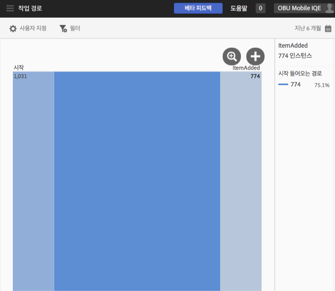

# 작업 경로 보고서{#action-paths}

작업 경로 보고서는 경로 분석을 기반으로 하며, 앱의 한 상태에서 다른 상태로 이동되는 경로를 나타내는 경로 지정 차트를 표시합니다.

**[!UICONTROL 경로 보기]** 및 **[!UICONTROL 작업 경로 보고서는 모두 경로 지정 보고서입니다.]** **[!UICONTROL 경로 보기]** 보고서는 사용자가 앱의 한 화면에서 다음 화면으로 이동하는 방식을 보여줍니다. **[!UICONTROL 작업 보기]** 보고서는 사용자가 앱에서 수행하는 클릭, 선택, 크기 조정 등과 같은 작업 및 이벤트 순서를 표시합니다.

>[!TIP]
>
>단계 보고서를 사용하여 한 보고서에 탐색과 작업을 결합할 수 있습니다. 자세한 내용은 [단계](/help/using/usage/reports-funnel.md)를 참조하십시오.

상자 모양의 각 노드는 앱에서 사용자 경로에 있는 상태를 나타냅니다. 예를 들어 위의 그래픽에서 상단 노드는 앱을 시작한 다음 갤러리에서 사진을 선택한 사용자의 수를 나타냅니다.

차트를 수정하는 옵션을 표시하려면 노드를 클릭하고 **[!UICONTROL 포커스]** 또는 **[!UICONTROL 확장]**&#x200B;을 클릭하십시오. 예를 들어, 맨 위 노드에서 **[!UICONTROL 사진 선택됨]** 상태를 클릭하면 **[!UICONTROL 포커스]** 및 **[!UICONTROL 확장]** 아이콘이 표시됩니다.

확장하려면 **[!UICONTROL +]** 아이콘을 클릭합니다. 이 옵션은 노드에 들어오거나 나가는 추가 경로를 표시합니다. 아래 그래픽에서 상태 1은 앱 시작이고 상태 2는 사진 선택(이전에 확장한 항목)이며 상태 3은 사용자가 사용한 다양한 경로를 포함합니다.

* 항목 선택
* 항목 추가
* 항목 드래그
* 항목 크기 조절

상태를 확장하는 것은 단계와 유사합니다.

노드를 분리하고 선택한 노드로 들어오고 나가는 경로를 표시하려면  아이콘을 클릭합니다. 아래 그래픽에서는 사용자가 사진을 선택하기 **전에** 다음 경로가 완료되었습니다.

* 항목 회전
* 항목 크기 조절
* 항목 드래그
* 항목 제거

사진을 선택한 사용자 중, 다음 경로가 사진을 선택한 **후에** 완료되었습니다.

* 항목 선택
* 항목 추가
* 항목 드래그
* 항목 크기 조절

여러 노드에 초점을 맞추거나 확장하여 앱에서 사용자가 선택하는 경로를 자세히 볼 수 있습니다. 예:

이 보고서에 대해 다음 옵션을 구성할 수 있습니다.

* **[!UICONTROL 기간]**

   **[!UICONTROL 달력]** 아이콘을 클릭하여 사용자 지정 기간을 선택하거나 드롭다운 목록에서 사전 설정된 기간을 선택합니다.

* **[!UICONTROL 사용자 지정]**

   **[!UICONTROL 표시 기준]** 옵션 변경, 지표 및 필터 추가, 시리즈(지표) 추가 등을 통해 보고서를 사용자 지정합니다. 자세한 내용은 [보고서 사용자 지정](/help/using/usage/reports-customize/reports-customize.md)을 참조하십시오.

* **[!UICONTROL 필터]**

   **[!UICONTROL 필터]**&#x200B;를 클릭하면 다른 보고서에 적용되는 필터를 생성하여 세그먼트가 모든 모바일 보고서에서 어떻게 작동하는지 확인할 수 있습니다. 고정 필터를 사용하면 경로 지정 외의 모든 보고서에 적용되는 필터를 정의할 수 있습니다. 자세한 내용은 [고정 필터 추가](/help/using/usage/reports-customize/t-sticky-filter.md)를 참조하십시오.

* **[!UICONTROL 다운로드]**

   **[!UICONTROL PDF]**&#x200B;나 **[!UICONTROL CSV]**&#x200B;를 클릭하여 문서를 다운로드하거나 열고, Mobile Services에 대한 액세스 권한이 없는 사용자와 공유하거나 프레젠테이션의 파일을 사용할 수 있습니다.
