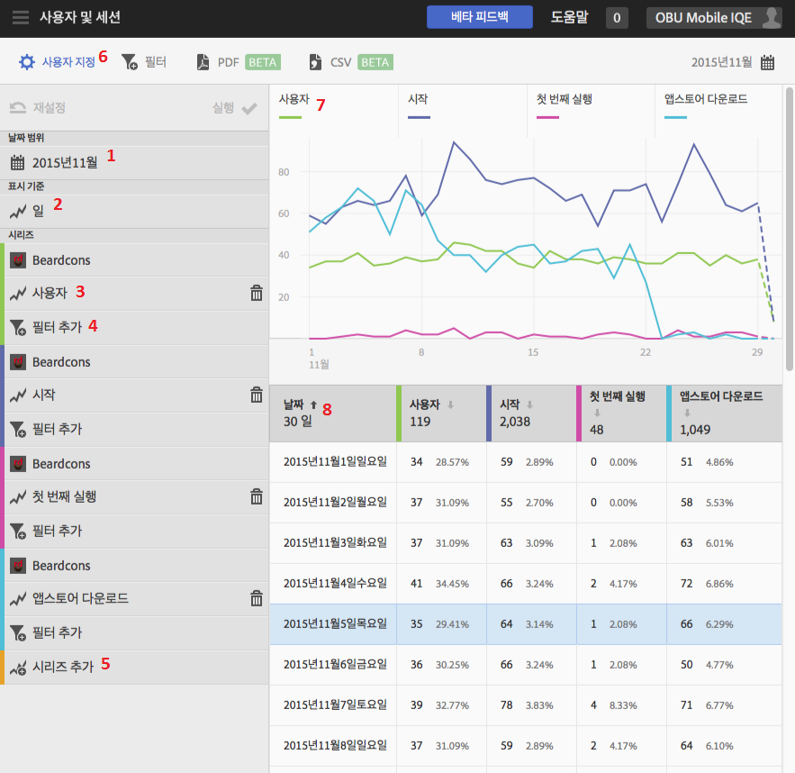

# Customize reports{#customize-reports}

이 정보는 기본 보고서를 이해하고 사용자 지정하는 데 도움이 됩니다.

날짜 범위, **[!UICONTROL 표시 기준]옵션(기간이나 차원별로 그래프 및 표 데이터 표시)을 변경하여 보고서를 사용자 지정하고, 지표 및 필터를 추가하고, 추가 시리즈(지표)를 추가하는 등의 작업을 수행할 수 있습니다.**

To display the Customize rail, click the name of the app to go to its Overview page, and click **[!UICONTROL Customize]**.

다음 예는 [사용자 지정] 레일이 열려 있는 사용자 및 세션 보고서를 보여줍니다. **** 이 예는 일별로 표시된 최근 30일 동안의 데이터를 네 개의 활성 시리즈로 표시합니다.

* **[!UICONTROL 사용자]**
* **[!UICONTROL 시작]**
* **[!UICONTROL 첫 번째 실행]**
* **[!UICONTROL 앱스토어 다운로드]**

다음 정보는 보고서의 각 영역과 **[!UICONTROL 사용자 지정]레일에 대해 설명합니다.**

| 수량 | 설명 |
|--- |--- |
| 1 | In **[!UICONTROL Date Ranges]**, the drop-down list lets you select various date ranges for your report. 차트(9)와 해당 표(10)에 있는 모든 데이터가 선택한 날짜 범위를 반영합니다. |
| 2 | In **[!UICONTROL Show By]**, the drop-down list lets you select a time-based or dimension-based display for your report.  예를 들어, 그림에서 일 수가 선택되어 있는 것을 알 수 있습니다. 차트(7) 아래의 날짜와 표(8)에 있는 행을 보면, 데이터 가 기간 보고서에 있는 날짜별로 분류되어 있습니다. 기간 보고서에는 보고서에 시리즈를 더 추가하여 최대 6개의 지표를 보고할 수 있습니다.  [라이프사이클] 차원을 선택하는 경우, 등급 목록에 있는 상위 50개 값이나, 일별 또는 주별로 상위 5개 트렌드, 또는 상위 5개 또는 10개 값 분류를 볼 수 있습니다. |
| 3 | **[!UICONTROL 시리즈]**&#x200B;는 위의 예에서 사용자, 시작, 첫 번째 실행 및 앱스토어 다운로드와 같은 개별 지표를 나타냅니다. 각 시리즈에는 차트(7)와 표(8)에 있는 데이터가 색상 코드로 처리되어 있습니다.  다른 보고서 세트의 추가 시리즈(지표)와 다른 앱을 추가하여 데이터를 비교할 수 있습니다.  For more information, see  Add Series (Metrics) to Reports. |
| 4 | With **[!UICONTROL Add Filter]**, you can customize the built-in reports by adding additional filters (segments).  For more information, see  Add Filters to Reports. |
| 5 | With **[!UICONTROL Add Series]**, you can customize the built-in reports by adding additional series (metrics) or apps in different report suites to compare data.  For more information, see Add Series (Metrics) to Reports. |
| 6 | With **[!UICONTROL Sticky Filter]**, you can create a filter that spans different reports. 예를 들어, 모든 모바일 보고서에서 특정 세그먼트가 수행되는 방식을 확인할 수 있습니다. 고정 필터를 사용하면 경로 지정 외의 모든 보고서에 적용되는 필터를 정의할 수 있습니다.  For more information, see Add Sticky Filter. |
| 7 | **[!UICONTROL 데이터 차트]는 선택한 지표를 기반으로 하여 적절한 차트에 데이터를 표시됩니다.** 차트 유형에는 라인 차트, 막대 차트, 도넛 차트 등이 포함됩니다. |
| 8 | **[!UICONTROL 데이터 테이블]은 데이터를 테이블 형식으로 표시합니다.** 열 헤더를 클릭하여 데이터를 내림차순이나 오름차순으로 정렬할 수 있습니다. |

