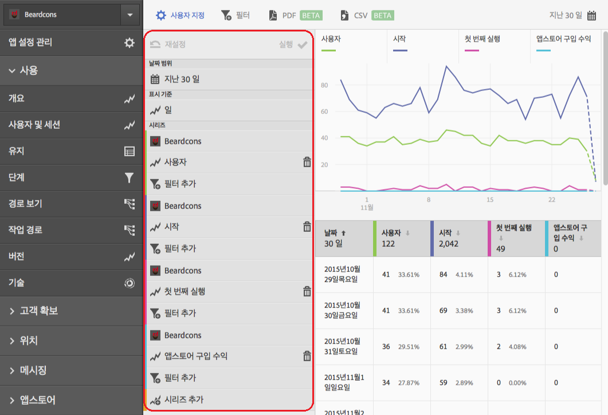
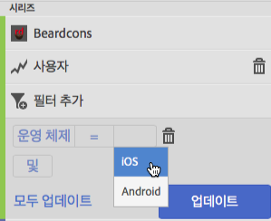
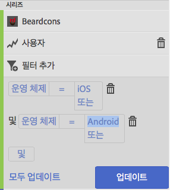
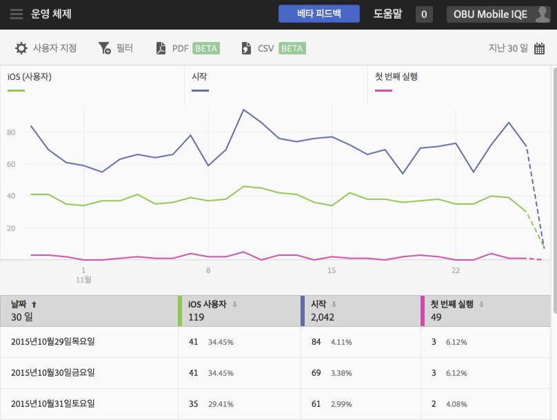
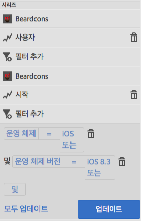

# 보고서에 필터 추가{#add-filters-to-reports}

이 정보는 필터(세그먼트)를 추가하여 기본 제공된 보고서를 사용자 지정하는 데 도움이 됩니다.

>[!IMPORTANT]
>
>모바일 앱 지표는 Marketing reports &amp; analytics, Ad Hoc Analysis, Data Warehouse 및 기타 Analytics 보고 인터페이스에서도 사용할 수 있습니다. Adobe Mobile에서 분류 또는 보고서 유형을 사용할 수 없는 경우 다른 보고 인터페이스를 사용하여 생성할 수 있습니다.

이 예에서는 **[!UICONTROL 사용자 및 세션]** 보고서를 사용자 지정하지만, 지침은 모든 보고서에 적용됩니다.

1. 앱을 열고 **[!UICONTROL 사용]** > **[!UICONTROL 사용자 및 세션]**&#x200B;을 클릭합니다.

   

   이 보고서는 앱 사용자에 대한 전체 기간 보기를 제공합니다. 하지만 이 앱의 iOS 및 Android 버전 모두에 대한 지표는 동일한 보고서 세트에서 수집됩니다. 사용자 지정 필터를 사용자 지표에 추가하여 모바일 OS별로 사용자를 세그먼트화할 수 있습니다.

1. **[!UICONTROL 사용자 지정]**&#x200B;을 클릭합니다.

   

1. **[!UICONTROL 사용자]**&#x200B;에서 **[!UICONTROL 필터 추가]**&#x200B;를 클릭하고 **[!UICONTROL 규칙 추가]**&#x200B;를 클릭합니다.

1. **[!UICONTROL 운영 체제]**&#x200B;를 선택하고 드롭다운 목록에서 **[!UICONTROL iOS]**&#x200B;를 선택합니다.

   

   Android를 필터로 추가하려면 이 단계를 반복 수행해야 합니다.

1. **[!UICONTROL 및]**&#x200B;을 클릭하고, 드롭다운 목록에서 **[!UICONTROL 운영 체제]**&#x200B;를 선택한 다음 **[!UICONTROL Android]**&#x200B;를 선택합니다.

   이제 필터가 다음의 예처럼 표시되어야 합니다.

   

1. **[!UICONTROL 업데이트를 클릭합니다]**.
1. 보고서를 재생성하려면 **[!UICONTROL 실행]**&#x200B;을 클릭합니다.

   이제 이 보고서에는 운영 체제별로 분류된 사용자가 표시됩니다. 보고서 제목이 보고서에 적용된 필터와 일치하도록 변경되었습니다.

   

   이 보고서를 자세히 사용자 지정할 수 있습니다. iOS 8.3에서 iOS 8.3 운영 체제 버전 필터를 사용하여 첫 번째 실행 지표를 추가하여 자신의 앱을 업그레이드하고 첫 번째 실행을 수행한 iOS 8.3 고객 수를 볼 수 있습니다.
1. **[!UICONTROL 첫 번째 실행]**&#x200B;에서 **[!UICONTROL 필터 추가]**&#x200B;를 클릭하고, **[!UICONTROL 규칙 추가]**&#x200B;를 클릭한 다음, 드롭다운 목록에서 **[!UICONTROL 운영 체제]**&#x200B;를 선택하고, **[!UICONTROL iOS]**&#x200B;를 선택합니다.
1. **[!UICONTROL 및]**&#x200B;을 클릭하고, 드롭다운 목록에서 **[!UICONTROL 운영 체제 버전]**&#x200B;을 선택한 다음 **[!UICONTROL iOS 8.3]**&#x200B;을 선택합니다.

   이제 필터가 다음의 예처럼 표시되어야 합니다.

   

1. **[!UICONTROL 업데이트]** 및 **[!UICONTROL 실행]**&#x200B;을 클릭합니다.

   이제 이 보고서에는 앱을 처음으로 시작한 iOS 8.3 사용자가 표시됩니다.

   

   시간을 내어 보고서 사용자 지정 메뉴의 다른 옵션을 테스트하고 즐겨찾기를 책갈피로 지정하십시오. Adobe Mobile의 보고서 URL은 정상적으로 작동하므로 즐겨찾기에 추가하거나 이메일로 전송할 수 있습니다.
