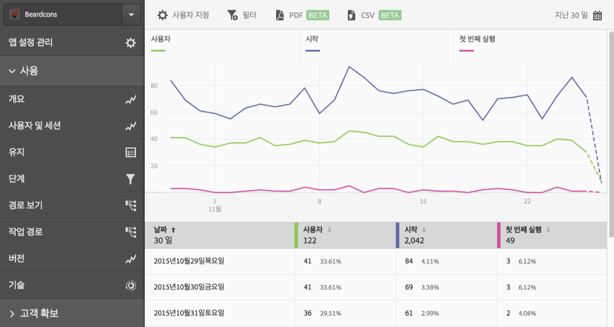

# Add filters to reports{#add-filters-to-reports}

이 정보는 필터(세그먼트)를 추가하여 기본 제공된 보고서를 사용자 지정하는 데 도움이 됩니다.

>[!IMPORTANT]
>
>모바일 앱 지표는 마케팅 보고 및 분석, 애드혹 분석, 데이터 웨어하우스 및 기타 분석 보고 인터페이스에서도 사용할 수 있습니다. Adobe Mobile에서 분류 또는 보고서 유형을 사용할 수 없는 경우 다른 보고 인터페이스를 사용하여 생성할 수 있습니다.

이 예에서는 **[!UICONTROL 사용자 및 세션]보고서를 사용자 지정하지만, 지침은 모든 보고서에 적용됩니다.**

1. Open your app and click **[!UICONTROL Usage]** &gt; **[!UICONTROL Users &amp; Sessions]**.

   

   이 보고서에서는 앱 사용자에 대한 전체 시간별 보기를 제공합니다. 하지만, 이 앱의 iOS와 Android 버전 모두에 대한 지표는 동일한 보고서 세트에서 수집됩니다. 사용자 지정 필터를 사용자 지표에 추가하여 모바일 OS별로 사용자를 세그멘트화할 수 있습니다.

1. **[!UICONTROL 사용자 지정을]**&#x200B;클릭합니다.

   

1. **[!UICONTROL 사용자]**&#x200B;아래에서 필터 **[!UICONTROL 추가를 클릭하고]** 규칙 **[!UICONTROL 추가를]**&#x200B;클릭합니다.

1. **[!UICONTROL 운영 체제를]**&#x200B;선택하고 드롭다운 목록에서 **[!UICONTROL iOS]**&#x200B;를 선택합니다.

   

   Android를 필터로 추가하려면 이 단계를 반복해야 합니다.

1. **[!UICONTROL 을 클릭하고]**&#x200B;드롭다운 목록에서 **[!UICONTROL 운영 체제를]** 선택하고 **[!UICONTROL Android]**&#x200B;를 선택합니다.

   이제 필터가 다음의 예처럼 표시되어야 합니다.

   

1. **[!UICONTROL 업데이트를 클릭합니다]**.
1. To regenerate the report, click **[!UICONTROL Run]**.

   이제 이 보고서에 운영 체제별로 분류된 사용자가 표시됩니다. 보고서 제목은 보고서에 적용된 필터와 일치하도록 변경되었습니다.

   

   이 보고서를 더 사용자 지정할 수 있습니다. iOS 8.3에서 iOS 8.3 운영 체제 버전 필터로 첫 번째 시작 지표를 추가하여 몇 개의 iOS 8.3 고객이 앱을 업그레이드하고 첫 번째 실행을 수행했는지 확인할 수 있습니다.
1. **[!UICONTROL 첫 번째 실행]**&#x200B;아래의 필터 ****&#x200B;추가를 클릭하고 규칙 ****&#x200B;추가를 클릭한 다음 드롭다운 목록에서 **[!UICONTROL 운영 체제를]** 선택하고 **[!UICONTROL iOS]**&#x200B;를 선택합니다.
1. **[!UICONTROL 을 클릭하고]**&#x200B;드롭다운 목록에서 **[!UICONTROL 운영 체제 버전을]** 선택하고 **[!UICONTROL iOS 8.3]**&#x200B;를 선택합니다.

   이제 필터가 다음의 예처럼 표시되어야 합니다.

   

1. **[!UICONTROL 업데이트]** 및 **[!UICONTROL 실행을]**&#x200B;클릭합니다.

   이제 이 보고서에 앱을 처음 실행한 iOS 8.3 사용자가 표시됩니다.

   

   시간을 내어 보고서 사용자 지정 메뉴에서 여러 옵션을 테스트해 보고, 자주 사용하는 항목을 책갈피에 추가하십시오. Adobe Mobile의 보고서 URL는 기능적이며 이메일로 전송하거나 즐겨찾기에 추가할 수 있습니다.
