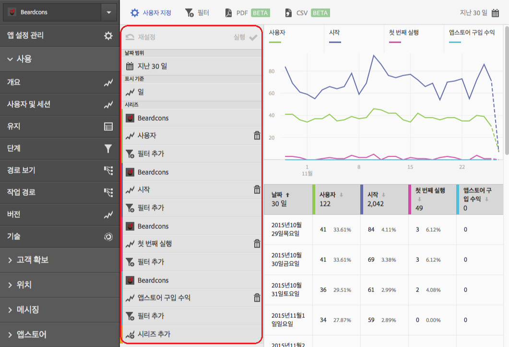

# 보고서에 시리즈(지표) 추가{#add-series-metrics-to-reports}

이 정보는 데이터를 비교하기 위해 다른 보고서 세트에 시리즈(지표)나 앱을 추가하여 기본 제공된 보고서를 사용자 지정하는 데 도움이 됩니다.

>[!IMPORTANT]
>
>모바일 앱 지표는 Marketing Reports &amp; Analytics, Ad Hoc Analysis, Data Warehouse 및 기타 Analytics 보고 인터페이스에서도 사용할 수 있습니다. Adobe Mobile에서 분류 또는 보고서 유형을 사용할 수 없는 경우 다른 보고 인터페이스를 사용하여 생성할 수 있습니다.

이 예에서는 **[!UICONTROL 사용자 및 세션]** 보고서를 사용자 지정하지만, 지침은 모든 보고서에 적용됩니다.

1. 앱을 열고 **[!UICONTROL 사용]** > **[!UICONTROL 사용자 및 세션]**&#x200B;을 클릭합니다.

   

   이 보고서는 앱 사용자에 대한 전체 기간 보기를 제공합니다. 하지만, 앱 충돌에 대해 보고할 시리즈를 추가하려고 합니다.

1. **[!UICONTROL 사용자 지정]**&#x200B;을 클릭합니다.

   

1. **[!UICONTROL 아래로 스크롤하여 시리즈 추가]**&#x200B;를 클릭합니다.

   시리즈 이름이 목록에 있는 마지막 시리즈와 동일한 이름으로 채워집니다. 이전 그림에서 최신 시리즈는 **[!UICONTROL 앱스토어 다운로드]**&#x200B;이므로 새 시리즈가 추가되고, 또한 **[!UICONTROL 앱스토어 다운로드]**&#x200B;라는 제목이 지정됩니다.

1. 다음 작업 중 하나를 완료하십시오.

   * 새 시리즈(지표)를 추가하려면 방금 작성한 시리즈 이름을 클릭하고 드롭다운 목록에서 새 라이프사이클 지표를 선택합니다.

      

   * 앱 간의 데이터를 비교할 수 있도록 다른 보고서 세트에서 새 앱을 추가하려면, 새로 만든 시리즈에서 앱 이름을 클릭하고 원하는 앱을 선택합니다.

      

1. (조건부) 필터를 새 시리즈에 추가합니다.

   자세한 내용은 [보고서에 필터 추가](/help/using/usage/reports-customize/t-reports-customize.md)를 참조하십시오.
1. **[!UICONTROL 업데이트]** 및 **[!UICONTROL 실행]**&#x200B;을 클릭합니다.
