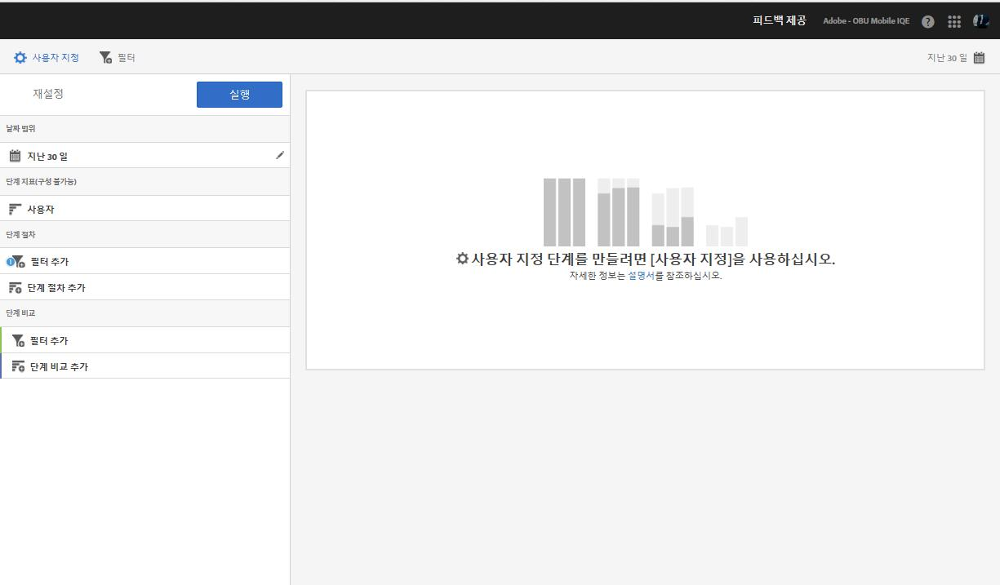
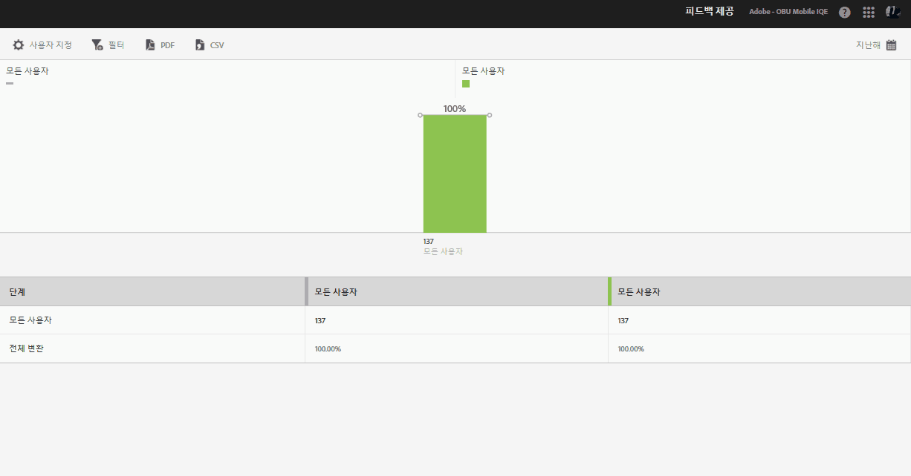

# 단계 보고서{#funnel}

**[!UICONTROL 단계]** 보고서를 사용하면 고객이 마케팅 캠페인을 포기하는 상황이나, 모바일 앱과 상호 작용할 때 정의된 전환 경로를 벗어나는 상황을 식별할 수 있으며, **[!UICONTROL 단계]** 보고서를 사용하여 서로 다른 세그먼트의 작업을 비교할 수도 있습니다.

각 단계에서 고객 결정을 시각화하면 고객이 단념하는 상황, 고객이 잘 따르는 경로, 고객이 앱을 나가는 시점을 이해할 수 있습니다.

**[!UICONTROL 단계]** 보고서를 열 때 사용자 지정 단계를 생성해야 합니다. 자세한 내용은 [보고서 사용자 지정](/help/using/usage/reports-customize/reports-customize.md)을 참조하십시오.

>[!TIP]
>
>사용자 지정 단계를 저장하려면 해당 설정을 구성하고 보고서를 실행한 후 URL을 저장하십시오. URL을 공유하거나 문서에 저장할 수 있습니다.

다음은 이 보고서의 예입니다.

간단한 단계를 보여주기 위해서, 3단계 절차와 2단계 비교를 사용하는 구성에 대한 설정이 여기에 있습니다. 데모 앱에서 사진 등의 항목을 추가한 다음 공유할 수 있다고 가정합니다.

사용자 지정 창에는 사용자가 앱을 실행하고, 앱의 갤러리에서 사진을 추가하고, 소셜 미디어에서 앱의 사진을 하나 이상 공유했다는 섹션이 있습니다. 단계 비교를 통해 iOS 앱 사용자와 Android 앱 사용자 간에 사진을 추가하고 공유하는 수준을 비교할 수 있습니다.

보고서를 생성하려면 **[!UICONTROL 실행을 클릭하십시오]**.

다음은 생성된 보고서의 예입니다.

첫 번째 시리즈는 100%의 사용자가 앱을 시작한 것을 보여줍니다. 두 번째 시리즈는 더 높은 비율의 Android 사용자가 갤러리의 사진을 추가했음을 보여줍니다. 세 번째 시리즈는 거의 절반의 iOS 사용자가 사진을 공유했지만, Android 사용자 중 아무도 사진을 공유하지 않았다는 것을 보여줍니다. 앱에 조사가 필요한 문제가 있음을 나타낼 수도 있습니다.

추가 정보를 표시하려면 차트의 막대 위에 마우스를 놓습니다.

이 보고서에 대해 다음 옵션을 구성할 수 있습니다.

* **[!UICONTROL 기간]**

   **[!UICONTROL 달력]** 아이콘을 클릭하여 사용자 지정 기간을 선택하거나 드롭다운 목록에서 사전 설정된 기간을 선택합니다.
* **[!UICONTROL 사용자 지정]**

   **[!UICONTROL 표시 기준]** 옵션 변경, 지표 및 필터 추가, 시리즈(지표) 추가 등을 통해 보고서를 사용자 지정합니다. 자세한 내용은 [보고서 사용자 지정](/help/using/usage/reports-customize/reports-customize.md)을 참조하십시오.
* **[!UICONTROL 필터]**

   **[!UICONTROL 필터]**&#x200B;를 클릭하면 다른 보고서에 적용되는 필터를 생성하여 세그먼트가 모든 모바일 보고서에서 어떻게 작동하는지 확인할 수 있습니다. 고정 필터를 사용하면 경로 지정 외의 모든 보고서에 적용되는 필터를 정의할 수 있습니다. 자세한 내용은 [고정 필터 추가](/help/using/usage/reports-customize/t-sticky-filter.md)를 참조하십시오.
* **[!UICONTROL 다운로드]**

   **[!UICONTROL PDF]**&#x200B;나 **[!UICONTROL CSV]**&#x200B;를 클릭하여 문서를 다운로드하거나 열고, Mobile Services에 대한 액세스 권한이 없는 사용자와 공유하거나 프레젠테이션의 파일을 사용할 수 있습니다.
