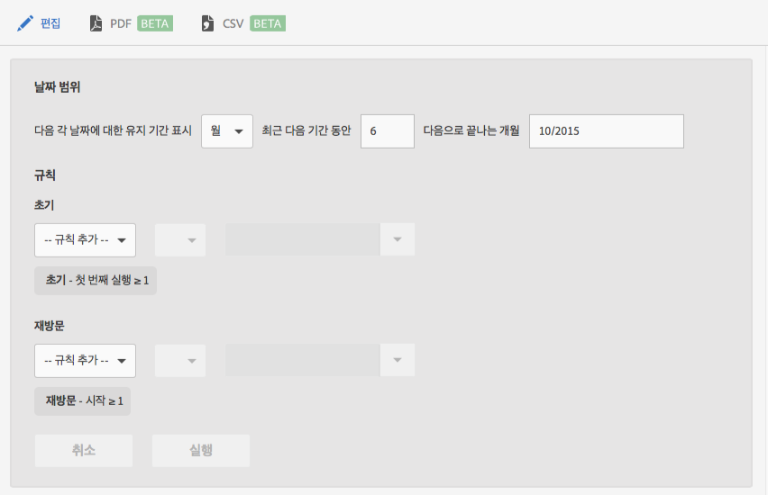

# 유지 보고서 {#retention}

**[!UICONTROL 유지]보고서(이전의 첫 번째 실행 그룹)는 처음으로 앱을 시작했다가 그 다음 달에 적어도 한 번 앱을 다시 시작한 고유 사용자의 수를 표시하는 집단 보고서입니다.**

기본적으로 이 보고서는 사용자가 앱을 처음 시작한 시간을 기반으로 하여 사용자 그룹의 유지를 보여줍니다. 이 보고서를 사용자 지정하여 첫 번째 실행 이외의 지표를 사용하고 다른 작업을 추가할 수도 있습니다.

집단은 정의된 기간에 일반적인 특성이나 경험을 공유하는 사람들의 그룹입니다. **[!UICONTROL 유지]보고서는 특정 일, 주 또는 월에 앱을 설치한 사용자들의 일반적인 특성을 가져온 후, 그러한 사용자 중 다음 X일, 주 또는 개월 동안 앱을 실행한 사용자의 수를 차트로 표시합니다.** 이 보고서는 방문자가 활성 상태나 참여 상태로 얼마나 잘 유지되었는지를 보여줍니다.

다음은 이 보고서의 예입니다.

**[!UICONTROL MO]열에 2014년 11월에 처음으로 앱을 시작한 총 사용자 수가 표시됩니다.** **[!UICONTROL M1]열에는 2014년 12월에 앱을 다시 실행한 사용자의 수가 표시됩니다.**

날짜 범위를 변경하거나 보고서 규칙을 편집하려면 **[!UICONTROL 편집을 클릭합니다]**.

이 보고서는 계산된 지표가 아닌 라이프사이클 지표와 같은 변수 또는 지표로 채울 수 있습니다.
