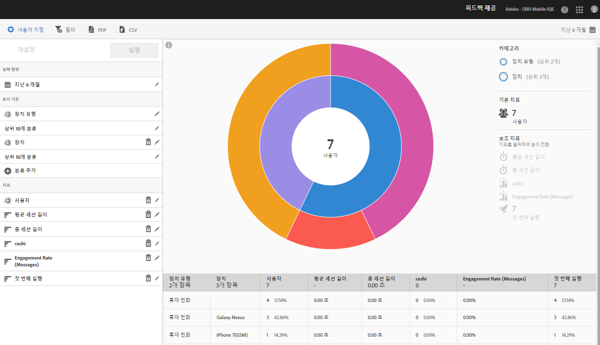

# 기술 보고서 {#technology}

**[!UICONTROL 기술]** 보고서를 통해 앱이 사용되는 다양한 장치 유형, 운영 체제, 운영 체제 버전 및 이동통신사를 확인할 수 있습니다.

이 보고서는 기존 데이터에 대한 Sunburst 시각화 시각화를 제공하므로, 이 보고서를 사용하여 타깃팅할 대상 세그먼트(방문자 컬렉션)를 검색할 수 있습니다. 대상을 만들고 관리하는 일은 현재 Experience Cloud에서 대상을 이용할 수 있다는 점을 제외하고, 세그먼트를 만들고 사용하는 일과 비슷합니다.

## 탐색 및 사용 {#section_83CA60E1AE6245FEBCBFF3205615C4DF}

이 시각화에서는 예를 들어, 기본 보고서와 분류를 제공하고 높이를 사용하여 지표를 초점에 표시하고 지표 간의 성능 차이를 제공합니다. 개별 고리는 고리 카테고리의 대상 세그먼트를 나타냅니다. 고정 필터 적용, 지표 숨기기, 지표 보기 등 대상에 대한 작업을 수행할 수 있습니다.

>[!TIP]
>
>이 정보 이외에 Sunburst 차트와 상호 작용하는 방법을 설명하는 제품 내 자습서를 볼 수 있습니다. 자습서를 시작하려면 보고서의 제목 표시줄에서 **[!UICONTROL 기술 분류]**&#x200B;를 클릭하고, **[!UICONTROL 사용자 지정]**&#x200B;을 클릭한 다음 **[!UICONTROL i]** 아이콘을 클릭하십시오.

Sunburst 차트는 대화형이며 다음 작업을 완료할 수 있습니다.

* 자세한 정보를 표시하려면 마우스를 차트 위에 놓으십시오.
* **[!UICONTROL 달력]** 아이콘을 클릭하여 기간을 변경합니다.
* 확대하기, 대상 숨기기, 인앱 메시지 또는 고정 필터 생성하기 등의 작업을 수행할 수 있는 대상을 선택하려면 고리에서 구획을 클릭합니다.
* 오른쪽 상단 모서리에서 **[!UICONTROL 장치 유형]** 및 **[!UICONTROL 장치]**&#x200B;를 선택하여 장치 및 장치 유형에 대한 정보를 확인합니다.

* 오른쪽에 있는 보조 지표를 클릭하여 시각화에 추가합니다.

   색상, 높이 또는 둘 다를 사용하여 두 번째 지표를 표시할 수 있습니다.

다음 표는 표준 보고서와 이러한 보고서가 Mobile Services에서 채워지는 방법을 설명합니다.

| 보고서 | 모집단 방법 | 설명 |
|--- |--- |--- |
| 장치 | 라이프사이클 지표 | 장치 유형별로 분류된 일반적인 지표. |
| 운영 체제 | 자동 | 운영 체제별로 분류된 일반적인 지표. |
| 운영 체제 버전 | 라이프사이클 지표 | 운영 체제 버전별로 분류된 일반적인 지표. |
| 통신사 | 자동 | 통신사별로 분류된 일반적인 지표. |

>[!TIP]
>
>**[!UICONTROL 통신사]** 보고서에서 Wi-Fi 사용자는 `none`으로 보고됩니다.

## 분류 및 지표 추가 {#section_15833511E82648869E7B1EFC24EF7B82}

차트에서 다른 대상과 관련하여 각 대상의 높이를 변경하는 분류 및 보조 지표를 추가할 수 있습니다.

>[!IMPORTANT]
>
>Sunburst에 고리를 많이 추가할수록 처리 시간이 오래 걸립니다.

분류 및 보조 지표를 추가하려면, 보고서의 제목 표시줄에서 **[!UICONTROL 기술 분류]**&#x200B;를 클릭한 다음, **[!UICONTROL 사용자 지정]**&#x200B;을 클릭합니다.

**[!UICONTROL 분류 추가]** 또는 **[!UICONTROL 지표 추가]**&#x200B;를 클릭하면, 새 항목이 목록에 있는 이전 항목과 동일한 이름으로 표시됩니다. 새 항목을 선택할 수 있는 드롭다운 목록에 액세스하려면 새로 만든 분류나 지표를 클릭하십시오.

## 고정 필터 만들기 {#section_B4E355CD1FE34E4C8ADC38139ED67FC8}

고리에서 구획을 클릭하여 고정 필터를 만들 대상을 선택한 다음, **[!UICONTROL 고정 필터를 클릭합니다]**. 이 필터를 사용하면 현재 필터를 적용하고 필터를 기반으로 새 보고서를 실행할 수 있습니다.

## 보고서 공유 {#section_560DD5CED5144249B7E49461E2422100}

보고서를 만든 후 설정을 사용하여 복사 및 공유할 수 있는 사용자 지정 URL을 만듭니다.
