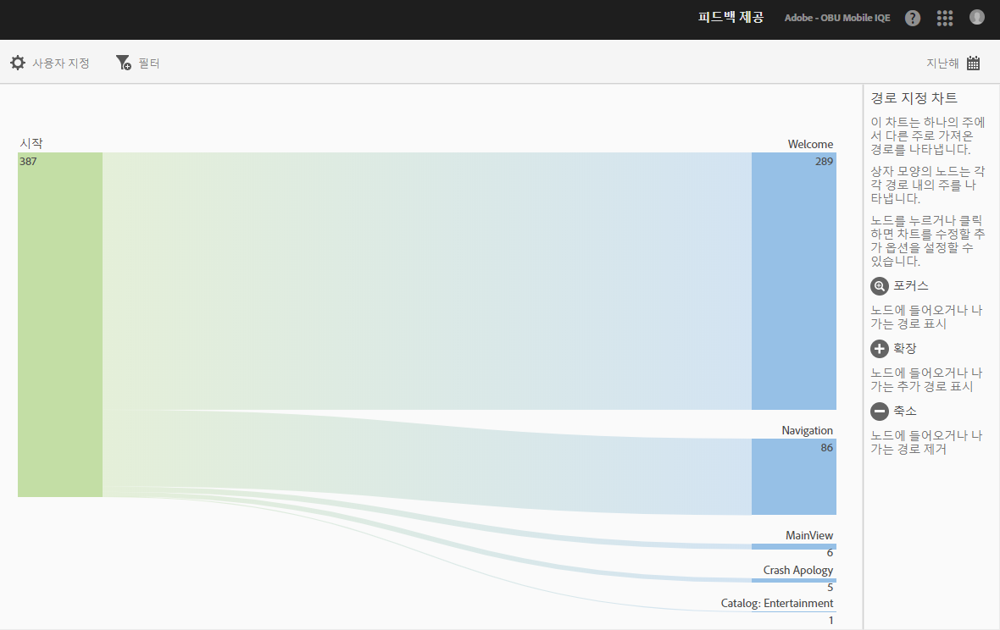
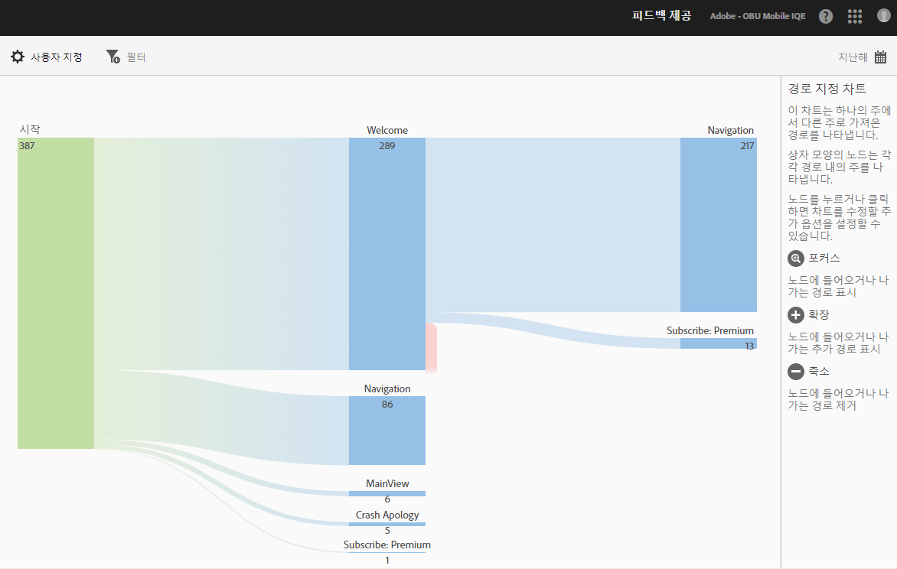
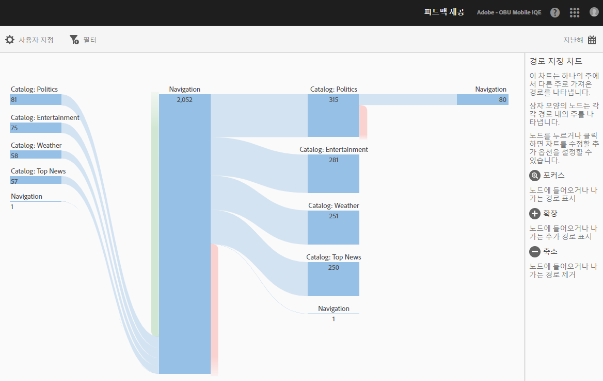

# 경로 보기 보고서 {#view-paths}

경로 분석을 기반으로 하는 **[!UICONTROL 경로 보기]** 보고서는 앱의 상태 간에 이동된 경로를 나타내는 경로 지정 차트를 표시합니다.

>[!TIP]
>
>**[!UICONTROL 경로 보기]** 및 **[!UICONTROL 작업 보기]** 보고서는 둘 다 경로 지정 보고서이므로 유사합니다. **[!UICONTROL 경로 보기]** 보고서를 사용하면 사용자가 앱의 한 화면에서 다음 화면으로 이동하는 방식을 알 수 있습니다. **[!UICONTROL 작업 보기]** 보고서는 사용자가 앱에서 수행하는 클릭, 선택, 크기 조정 등과 같은 작업 및 이벤트 순서를 표시합니다. 단계 보고서를 사용하여 한 보고서에 탐색과 작업을 결합할 수 있습니다. 자세한 내용은 [단계](/help/using/usage/reports-funnel.md)를 참조하십시오.

상자 모양의 각 노드는 앱에서 사용자 경로에 있는 상태를 나타냅니다. 예를 들어 위의 그림에서 맨 위 노드는 앱을 시작하고 기본 보기로 이동한 사용자의 수를 나타냅니다.

노드를 클릭하여 차트를 수정할 수 있는 추가 옵션을 제공하면 **[!UICONTROL 포커스]** 또는 **[!UICONTROL 확장]**&#x200B;과 같은 추가 옵션이 표시됩니다. 예를 들어, 맨 위 노드에서 **[!UICONTROL 기본 보기]** 상태를 클릭하면, **[!UICONTROL 포커스]** 및 **[!UICONTROL 확장]** 아이콘이 표시됩니다.

To expand the view, click the **[!UICONTROL +]** icon to display the additional paths that come in to or go from the node. 아래 그림에서 상태 1은 앱을 시작하고 상태 2는 앱의 기본 페이지를 보고 있으며 상태 3은 사용자가 사용한 다음 경로를 포함합니다.

* 카메라 롤로 이동
* 항목 선택기로 이동
* 카메라로 이동
* 항목 정보 페이지로 이동

노드를 격리하고 선택한 노드에서 들어오고 나가는 경로를 표시하려면 을 클릭합니다. 아래 그림에서 앱의 기본 보기를 보고 있던 사용자보다 다음 경로가 우선합니다.

* 항목 정보
* 항목 선택기
* 카메라 롤
* 카메라

여러 노드에 초점을 맞추거나 확장하여 사용자가 앱에서 선택하는 경로에 대해 자세히 볼 수 있습니다. 예:

이 보고서에 대해 다음 옵션을 구성할 수 있습니다.

* **[!UICONTROL 기간]**
****&#x200B;달력 아이콘을 클릭하여 사용자 지정 기간을 선택하거나 드롭다운 목록에서 사전 설정된 기간을 선택합니다.
* **[!UICONTROL 사용자 지정]**
**[!UICONTROL 표시 기준]** 옵션 변경, 지표 및 필터 추가, 시리즈(지표) 추가 등을 통해 보고서를 사용자 지정합니다. 자세한 내용은 [보고서 사용자 지정](/help/using/usage/reports-customize/reports-customize.md)을 참조하십시오.
* **[!UICONTROL 필터]**
**[!UICONTROL 필터]**&#x200B;를 클릭하면 다른 보고서에 적용되는 필터를 생성하여 세그먼트가 모든 모바일 보고서에서 어떻게 작동하는지 확인할 수 있습니다. 고정 필터를 사용하면 경로 지정 외의 모든 보고서에 적용되는 필터를 정의할 수 있습니다. 자세한 내용은 [고정 필터 추가](/help/using/usage/reports-customize/t-sticky-filter.md)를 참조하십시오.
* **[!UICONTROL 다운로드]**
**[!UICONTROL PDF]** 또는 **[!UICONTROL CSV]**&#x200B;를 클릭하여 문서를 다운로드하거나 열고, Mobile Services에 대한 액세스 권한이 없는 사용자와 공유하거나 프레젠테이션의 파일을 사용할 수 있습니다.