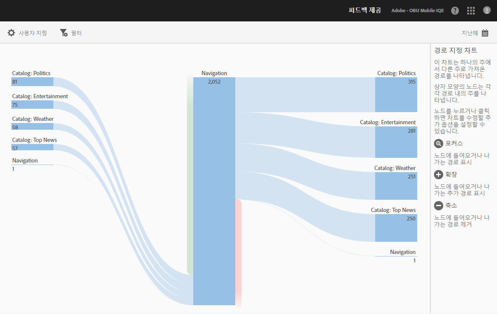

# 경로 보고서 보기 {#view-paths}

경로 분석을 기반으로 하는 **[!UICONTROL 경로 보기]보고서는 앱의 상태 간에 이동된 경로를 나타내는 경로 지정 차트를 표시합니다.**

>[!TIP]
>
>The **[!UICONTROL View Paths]** and **[!UICONTROL View Action]** reports are similar because both are pathing reports. **[!UICONTROL 경로 보기]보고서를 사용하면 사용자가 앱의 한 화면에서 다음 화면으로 이동하는 방식을 알 수 있습니다.** **[!UICONTROL 작업 보기]보고서는 사용자가 앱에서 수행하는 클릭, 선택, 크기 조정 등과 같은 작업 및 이벤트 순서를 표시합니다.** 단계 보고서를 사용하여 한 보고서에서 탐색과 작업을 결합할 수 있습니다. For more information, see [Funnel](/help/using/usage/reports-funnel.md).

상자 모양의 각 노드는 앱에서 사용자 경로에 있는 상태를 나타냅니다. 예를 들어, 위의 그림에서 맨 위의 노드는 앱을 시작한 다음, 기본 보기로 이동한 사용자의 수를 나타냅니다.

노드를 클릭하여 차트를 수정할 수 있는 추가 옵션을 제공하면 **[!UICONTROL 포커스]** 또는 **확장]과 같은 추가 옵션이 표시됩니다.[!UICONTROL ** 예를 들어, 맨 위 노드에서 **[!UICONTROL 기본 보기]** 상태를 클릭하면, **[!UICONTROL 포커스]및**&#x200B;확장] 아이콘이 표시됩니다.**[!UICONTROL **

To expand the view, click the **[!UICONTROL +]** icon to display the additional paths that come in to or go from the node. 아래 그림에서 상태 1은 앱을 실행하고, 상태 2는 앱의 기본 페이지를 표시하고, 상태 3에는 사용자가 수행한 다음 경로가 포함되어 있음을 나타냅니다.

* 카메라 롤로 이동
* 항목 선택기로 이동
* 카메라로 이동
* 항목 정보 페이지로 이동

Click  to isolate the node and to show the paths that are coming into and going out of the selected node. 아래 그림에서 다음 경로는 앱의 기본 보기를 보고 있는 사용자보다 먼저 발생했습니다.

* 항목 정보
* 항목 선택기
* 카메라 롤
* 카메라

여러 노드에 초점을 맞추거나 확장하여 앱에서 사용자가 선택하는 경로를 자세히 볼 수 있습니다. 예:

이 보고서에 대해 다음 옵션을 구성할 수 있습니다.

* **[!UICONTROL Time Period]**
Click the **[!UICONTROL Calendar]** icon to select a custom period or to select a preset time period from the drop-down list.
* **[!UICONTROL 사용자]**&#x200B;지정표시 기준 **[!UICONTROL 옵션을 변경하고,]** 지표 및 필터를 추가하고, 추가 시리즈(지표)를 추가하여 보고서를 사용자 지정합니다. For more information, see [Customize Reports](/help/using/usage/reports-customize/reports-customize.md).
* **[!UICONTROL 필터]**&#x200B;필터를 **[!UICONTROL 클릭하여]** 여러 보고서에 걸친 필터를 만들어 모든 모바일 보고서에서 세그먼트가 어떻게 작동하는지 확인합니다. 고정 필터를 사용하면 경로 지정 외의 모든 보고서에 적용되는 필터를 정의할 수 있습니다. 자세한 내용은 고정 필터 [추가를 참조하십시오](/help/using/usage/reports-customize/t-sticky-filter.md).
* **[!UICONTROL 다운로드]** PDF **[!UICONTROL 또는]** CSV **[!UICONTROL 를]** 클릭하여 문서를 다운로드하거나 열고 Mobile Services에 대한 액세스 권한이 없거나 프레젠테이션에서 파일을 사용하는 사용자와 공유할 수 있습니다.