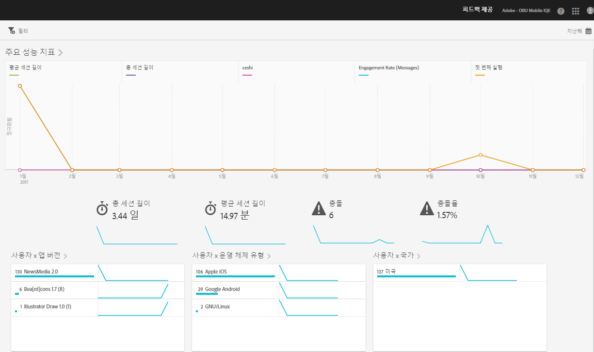

# 개요 보고서{#overview}

개요 보고서는 주요 지표에 대한 스냅숏을 제공합니다.

다음은 이 보고서의 예입니다.

오른쪽 상단의 달력 아이콘을 클릭하여 보고서의 날짜 범위를 변경할 수 있습니다. 다른 보고서에 적용되는 고정 필터를 생성하여 세그먼트가 모든 모바일 보고서에서 어떻게 작동하는지 확인할 수 있습니다. 고정 필터 만들기에 대한 자세한 내용은 [고정 필터 추가](/help/using/usage/reports-customize/t-sticky-filter.md)를 참조하십시오.

>[!TIP]
>
>앱을 생성할 때 이 보고서에 대한 주요 지표를 구성합니다. 자세한 내용은 [앱 구성](/help/using/c-manage-app-settings/c-mob-confg-app/c-mob-confg-app.md)을 참조하십시오.

