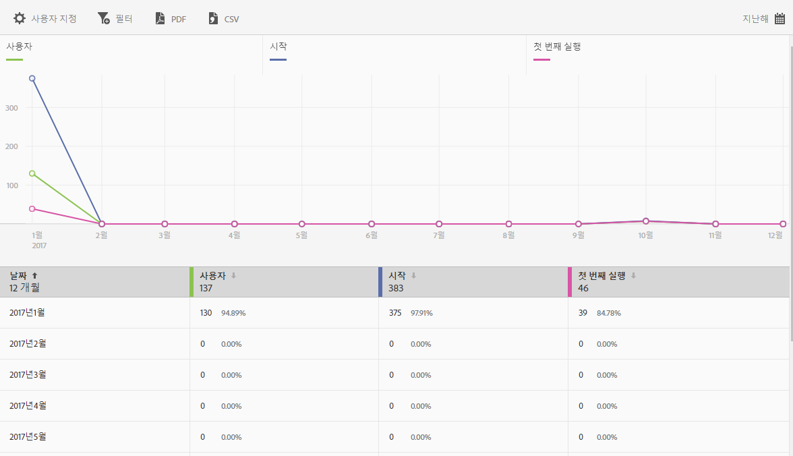

# 사용자 및 세션 보고서{#users-and-sessions}

사용자 및 세션 보고서에는 선택한 기간 동안 고유 방문자에 대한 지표가 표시됩니다.

이 보고서에 대해 다음 옵션을 구성할 수 있습니다.

* **[!UICONTROL 기간]**

   **[!UICONTROL 달력]아이콘을 클릭하여 사용자 지정 기간을 선택하거나 드롭다운 목록에서 사전 설정된 기간을 선택합니다.**

* **[!UICONTROL 사용자 지정]**

   **[!UICONTROL 표시 방법]** 옵션별 표시, 지표 및 필터 추가, 추가 시리즈 (지표) 추가 등을 통해 보고서를 사용자 지정할 수 있습니다. For more information, see [Customize Reports](/help/using/usage/reports-customize/t-reports-customize.md).

* **[!UICONTROL 필터]**

   **[!UICONTROL 필터]를 클릭하면 다른 보고서에 적용되는 필터를 생성하여 세그먼트가 모든 모바일 보고서에서 어떻게 작동하는지 확인할 수 있습니다.** 고정 필터를 사용하면 경로 지정 외의 모든 보고서에 적용되는 필터를 정의할 수 있습니다. 자세한 내용은 고정 필터 [추가를](/help/using/usage/reports-customize/t-sticky-filter.md)참조하십시오.

* **[!UICONTROL 다운로드]**

   **[!UICONTROL PDF]** 또는 **[!UICONTROL CSV]** 를 클릭하여 문서를 다운로드하거나 열거나 Mobile Services에 액세스할 수 없는 사용자와 공유하거나 프레젠테이션에 파일을 사용할 수 있습니다.