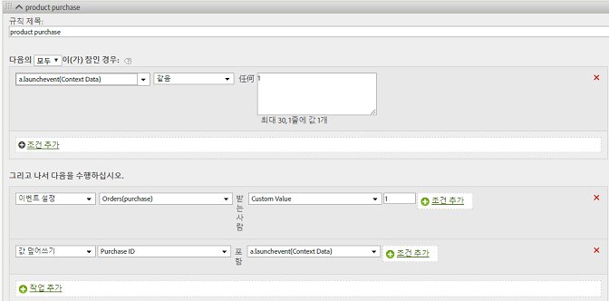

# Products variable{#products-variable}

products 변수는 처리 규칙을 사용하여 설정할 수 없습니다. Mobile SDK에서 컨텍스트 데이터 매개 변수에 특수 구문을 사용하여 서버 호출에 대해 직접 products를 설정해야 합니다.

*`products`* 변수를 설정하려면 컨텍스트 데이터 키를 설정하고 `"&&products"`다음에 대해 정의된 구문을 사용하여 값을 설정합니다 *`products`*.

```js
cdata["&&products"] = "Category;Product;Quantity;Price[,Category;Product;Quantity;Price]";
```

예:

```js
//create a context data dictionary 
var cdata = new Windows.Foundation.Collections.PropertySet(); 
 
// add products, a purchase id, a purchase context data key, and any other data you want to collect. 
// Note the special syntax for products 
cdata["&&products"] = ";Running Shoes;1;69.95,;Running Socks;10;29.99"; 
cdata["m.purchaseid"] = "1234567890"; 
cdata["m.purchase"] = "1"; 
 
var ADB = ADBMobile; 
// send the tracking call - use either a trackAction or TrackState call. 
// trackAction example: 
ADB.Analytics.trackAction("purchase", cdata); 
// trackState example: 
ADB.Analytics.trackState("Order Confirmation", cdata);
```

*`products`* 는 이미지 요청에 직접 설정되며 다른 변수는 컨텍스트 데이터로 설정됩니다. 모든 컨텍스트 데이터 변수는 처리 규칙을 사용하여 매핑해야 합니다.



SDK의 이미지 요청에 직접 설정되어 있으므로 처리 규칙을 사용하여 *`products`* 변수를 매핑할 필요는 없습니다.
